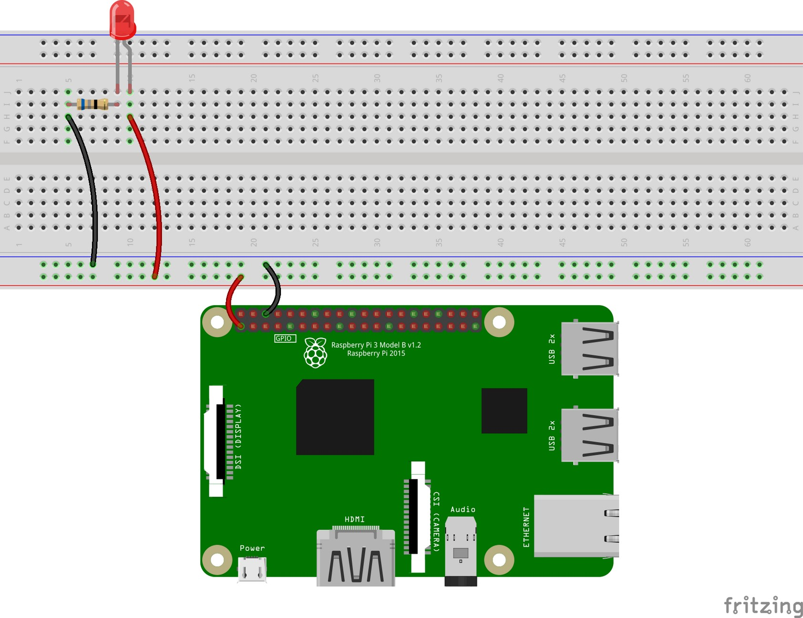
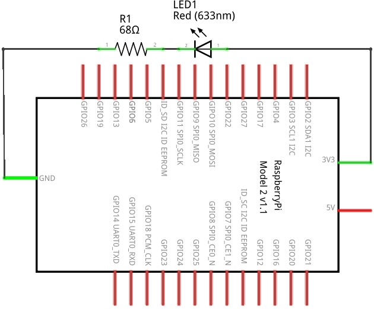
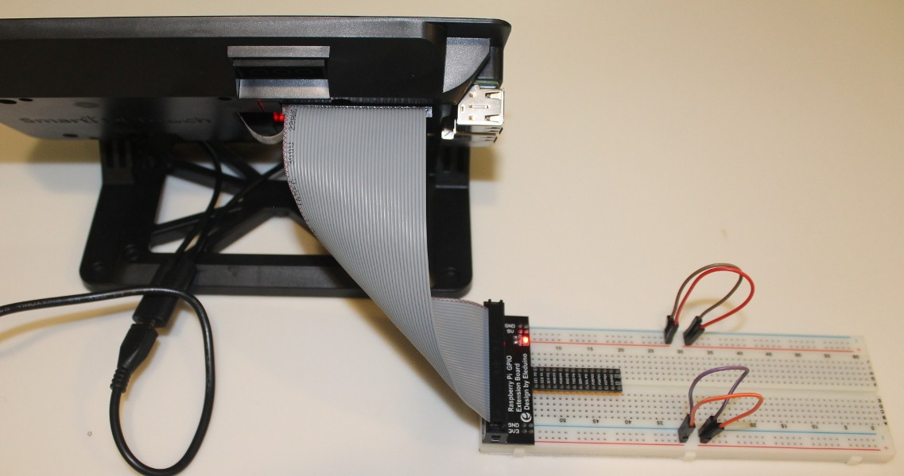
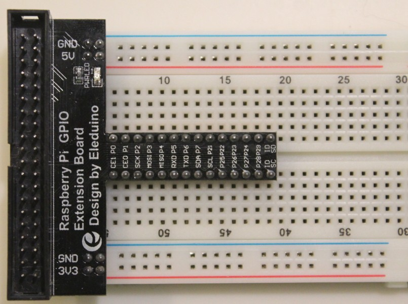
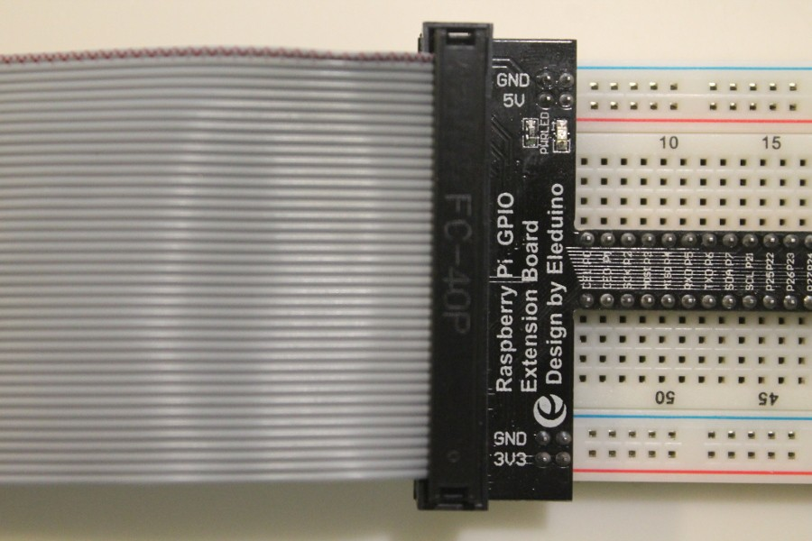
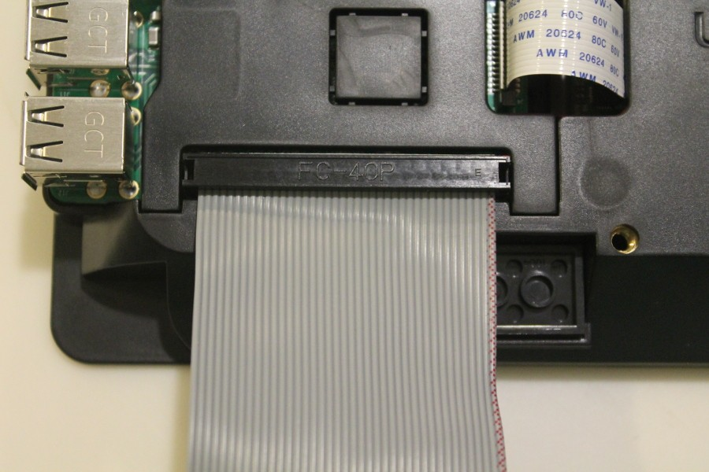
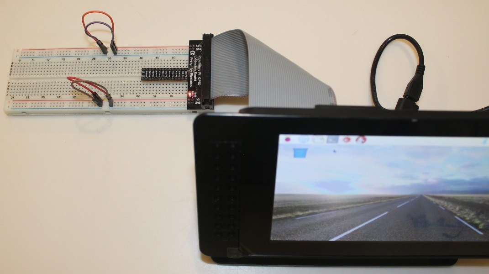
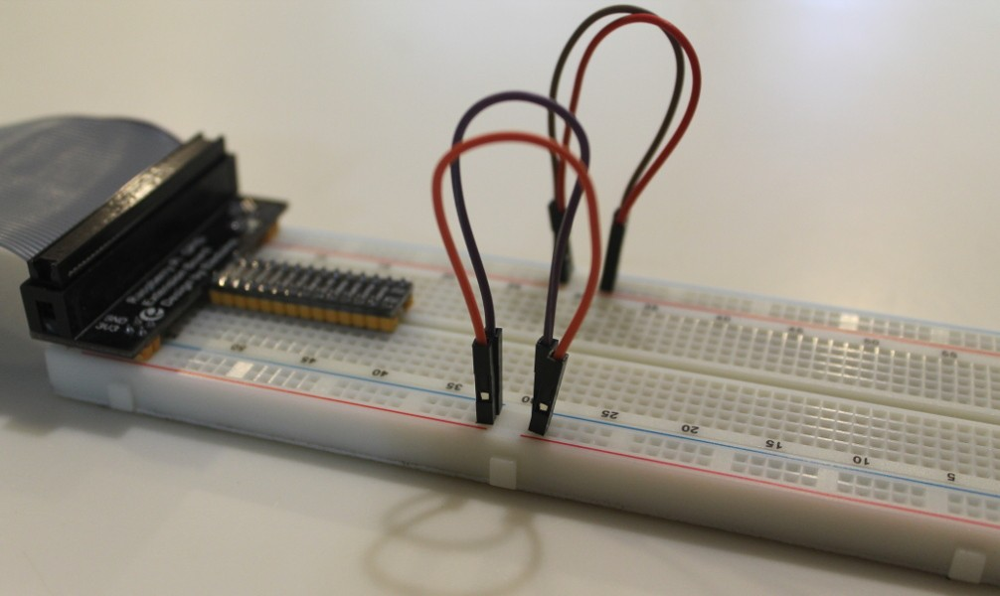
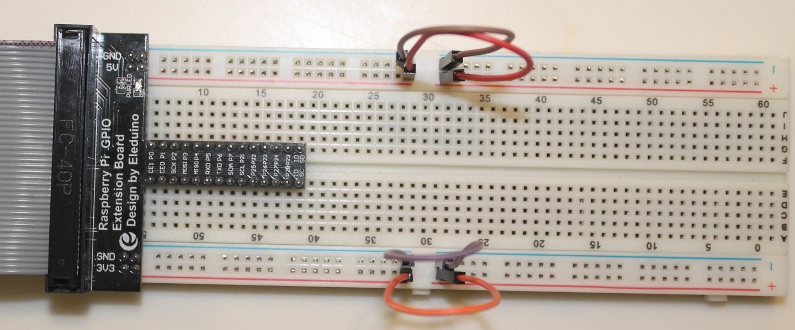
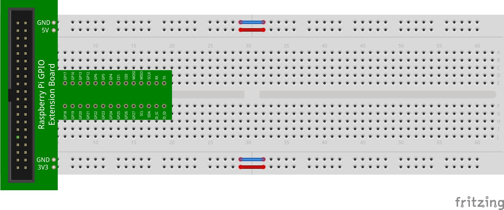

The first circuit you will implement is the very simple one shown in an earlier lesson (the topic of which was computer architecture). Here was the layout diagram of that circuit:

In the diagram, the red wire is connected on one end to a GPIO pin that exposes a 3.3V (3V3) power source. The other end is connected to the bottom row of the breadboard. Recall that this row is internally connected horizontally. Therefore, all holes in that row now have 3.3V.

The black wire is connected on one end to a GPIO pin that exposes ground (GND) or 0V. The other end is connected to the top row in the bottom section of the breadboard. Ground is therefore provided to all holes in that row.

The red LED is inserted so that its legs span across several columns in the center of the breadboard. Recall that these columns are internally connected vertically (however, there is a disconnect across the center gap). Note that the columns are numbered. So for example, the holes in column 20 are internally connected on either side of the center gap (but not to each other across the gap).

A red wire connected the 3.3V power source from the bottom row to the column that has the positive side of the LED (the long leg — or anode). A 68Ω resistor then connects the negative side of the LED (the short leg — or cathode) to ground. It does so by being placed across several columns (from the negative side of the LED to another column), and then by use of a black wire that brings ground to the other side of the LED.

In all, the circuit requires a red LED, a 68Ω resistor, and some jumper wires (oh, plus the RPi). Here is the circuit diagram:

The 68Ω resistor has the colored bands: blue, gray, black. Note that your kit does not come with 68Ω resistors! The closest one in your kit is a 220Ω resistor (which will work just fine). It has the colored bands: red, red, brown. For the circuits in this activity, you will use a 220Ω resistor.

## The GPIO Interface Board

Since the power source for the circuit will come from the RPi, we need a way to connect the GPIO pins to the breadboard. One way, as in the layout diagram above, is to connect wires to the GPIO pins and the breadboard. The problem is that the wires in your kit aren't particularly well suited for this. Your kit does, however, include a GPIO interface board that can extend the GPIO pins to the breadboard using a ribbon cable:

The GPIO interface board extends the GPIO pins to the central holes on the breadboard. First, place the GPIO interface on the breadboard as shown below:

Note that your kit may come with a different GPIO interface board. Perhaps it's a different color (e.g., green vs. black) or has a different pin layout. This activity includes directions for the various GPIO interface boards that may be part of your kit.

Note the orientation of the breadboard: the positive rails are on the bottom of each section at the top and bottom of the breadboard. Also, the entire GPIO interface rests on the breadboard (i.e., the left part of the GPIO interface in the image above does not hang over the edge of the breadboard), and the central pins straddle the gap in the center of the breadboard. When pressing the interface board into the breadboard, make sure to put even downward pressure entirely across it to prevent it from breaking.

Next, connect the ribbon cable to the GPIO interface as shown below:

Notice how the red edge of the ribbon cable (as noted by the arrows) is aligned with the top of the breadboard. There's also a tab on the hard plastic end of the ribbon cable that prevents it from being inserted incorrectly into the GPIO interface.

Next, connect the other end of the ribbon cable to the GPIO pins on the RPi that are exposed at the rear of the stand:

Again, notice the orientation of the ribbon cable! The best way to lay everything out is shown below.

If you've connected everything correctly, a little red LED on the GPIO interface should be on.

The GPIO interface allows circuits to be connected to the RPi's GPIO pins. It also exposes +5V, +3.3V, and GND. Viewed as before (where the GPIO interface is to the left of the breadboard), 5V and GND are on the top rails, and 3.3V and GND are on the bottom rails.

A word of caution, however! Your breadboard may not be internally connected across the entire top and bottom rails. If not, you will need to bridge the left and right halves of the rails as shown below to ensure that power and GND are exposed across the entire length of the rails:

This must be done for both 5V and GND in the top rails, and 3.3V and GND in the bottom rails. Here's a layout diagram of this, and the updated circuit using the interface board:

Note that it is assumed that a ribbon cable connects the interface board to the GPIO pins on the RPi (i.e., it is not shown in the layout diagrams).

## Building the Circuit

Create the circuit shown in the layout diagram below **without connecting the power adapter to the RPi yet**. Make sure that:

- The LED straddles two columns (i.e., does not have both of its legs in the same column of holes);
- You connect a wire from a 3.3V pin on the bottom rail to the positive side (long leg) of the LED; and
- You place a 220Ω resistor from the negative side (short leg) of the LED to ground (note that the GPIO interface board brings ground to both top rows of the top and bottom rails).

To summarize, use a red (or similar) wire to connect a 3.3V power source from the interface board to the positive side of the LED. Use a 220Ω resistor to connect the negative side of the LED to GND.

When you are certain that your circuit is correct, plug in the RPi. If everything is wired correctly, the LED should light.

::: {.callout-warning}
## Caution!
If you accidentally short 3.3V (or 5V for that matter) directly to ground (i.e., connect 3.3V or 5V directly to ground), your RPi will reset (and you may damage it in the process)!

And perhaps even more importantly, directly connecting 5V to 3.3V will **"brick"** your RPi. "Brick" is a term meaning to cause an electronic device to become completely unable to function (as in permanently).
:::