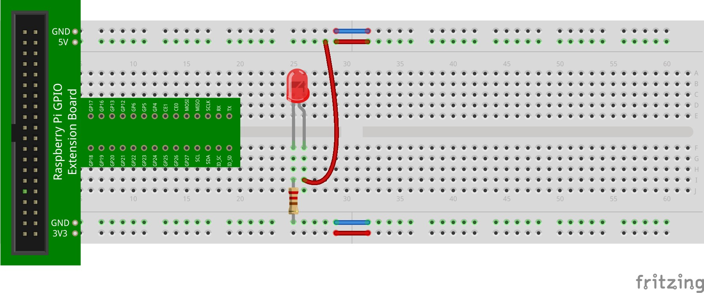

The resistor used in the circuit is a 220Ω resistor, the source voltage is 3.3V, and the LED has a forward voltage (i.e., voltage drop) of 2V (which we know from reading its data sheet). Using Ohm's Law, we can calculate the current that will flow through the circuit as follows:

$$
\begin{aligned}
V &= I \times R \\
(3.3\text{V} - 2\text{V}) &= I \times 220\Omega \\
1.3\text{V} &= I \times 220\Omega \\
I &= 0.00591\text{A} \\
I &= 5.91\text{mA}
\end{aligned}
$$


The current through the LED will be 5.91mA. This is much less than the recommended 20mA. Note that the brightness of the LED is directly related to how much current flows through it. The more current, the brighter it will be. Of course, there is a limit (as per the data sheet).

We can calculate the power dissipated by the resistor as follows:

$$
\begin{aligned}
P &= V \times I \\
P &= (3.3\text{V} - 2\text{V}) \times 0.00591\text{A} \\
P &= 1.3\text{V} \times 0.00591\text{A} \\
P &= 0.0077\text{W} \\
P &= 7.7\text{mW}
\end{aligned}
$$

The resistor in your kit is a 1/4W (250mW) resistor. It is more than enough. The power dissipated by the LED can be calculated similarly:

$$
\begin{aligned}
P &= V \times I \\
P &= 2\text{V} \times 0.00591\text{A} \\
P &= 0.0118\text{W} \\
P &= 11.8\text{mW}
\end{aligned}
$$

The LED in your kit has a forward current limit of 120mW. Again, it is more than enough.

## Increasing the Voltage

To make the LED a bit brighter, we cannot reduce the resistance in the circuit since there aren't any lesser-valued resistors in the kit. We can, however, change the source voltage! 

The RPi also has a 5V power source. Suppose you were to, instead, use the 5V power source from the RPi. This would provide more voltage to the breadboard and across the circuit. According to Ohm's Law, if we increase the voltage and keep the resistance in the circuit at 220 $\Omega$, the current has to increase. 

In the space below, calculate the current that would flow through the circuit with a 5V power source and a 220 $\Omega$ resistor:

```{ojs}
//| echo: false
viewof currentAnswer = Inputs.text({
  label: "Current (A):",
  placeholder: "e.g. 0.01984"
})

{
  const correct = 3 / 220;
  const tolerance = 0.001;
  const val = parseFloat(currentAnswer);
  if (!currentAnswer || isNaN(val))
    return html`<span></span>`;
  if (Math.abs(val - correct) <= tolerance)
    return html`<span style="color:green;font-weight:bold">✓ Correct!</span>`;
  else
    return html`<span style="color:red;font-weight:bold">✗ Not quite — double-check your Ohm's Law calculation.</span>`;
}
```

Now, calculate the power dissipated by the resistor for the 5V power source:

```{ojs}
//| echo: false
viewof resistorPower = Inputs.text({
  label: "Power (W):",
  placeholder: "e.g. 0.01984"
})

{
  const correct = 9 / 220;
  const tolerance = 0.002;
  const val = parseFloat(resistorPower);
  if (!resistorPower || isNaN(val))
    return html`<span></span>`;
  if (Math.abs(val - correct) <= tolerance)
    return html`<span style="color:green;font-weight:bold">✓ Correct!</span>`;
  else
    return html`<span style="color:red;font-weight:bold">✗ Not quite — double-check your power calculation.</span>`;
}
```

And finally, calculate the power dissipated by the LED for the 5V power source:

```{ojs}
//| echo: false
viewof ledPower = Inputs.text({
  label: "Power (W):",
  placeholder: "e.g. 0.01984"
})

{
  const correct = 6 / 220;
  const tolerance = 0.002;
  const val = parseFloat(ledPower);
  if (!ledPower || isNaN(val))
    return html`<span></span>`;
  if (Math.abs(val - correct) <= tolerance)
    return html`<span style="color:green;font-weight:bold">✓ Correct!</span>`;
  else
    return html`<span style="color:red;font-weight:bold">✗ Not quite — double-check your power calculation.</span>`;
}
```

So with the 220Ω resistor and a 5V power source, we increase the current — which should make the LED appear a bit brighter when lit.

Alter your circuit as in the figure below. The only difference is that the positive side of the LED should now be connected to 5V instead of 3.3V:




