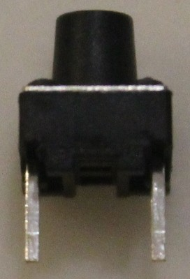
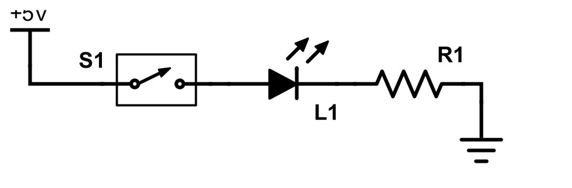
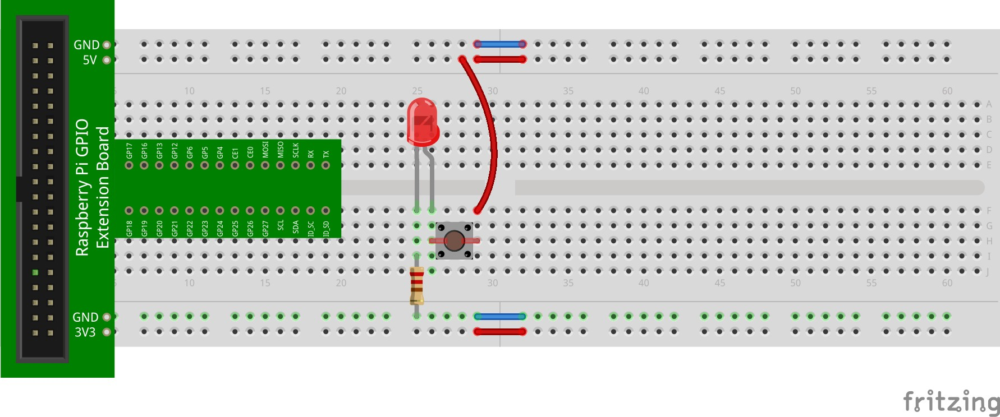
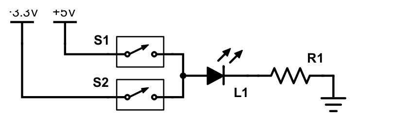
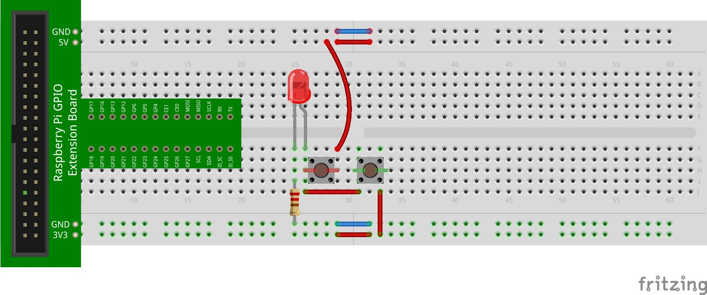
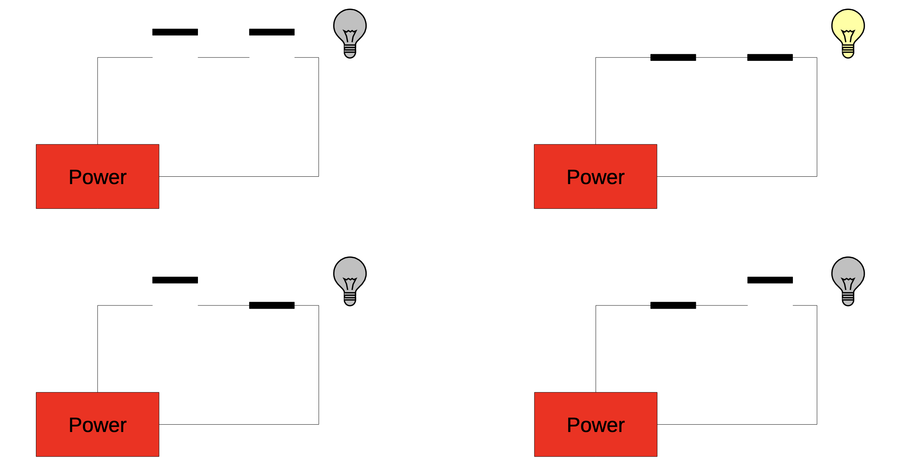
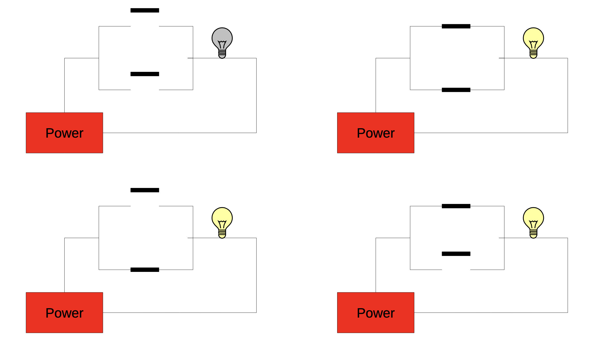
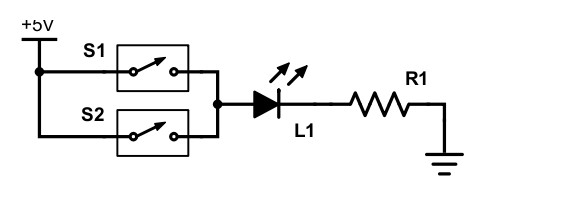

## Adding a Push-Button Switch

Let's add a push-button switch to the above circuit. The switch will control the flow of electricity to the circuit. If the button is pushed, current will flow and the LED will light. A push-button switch is a tactile switch that usually has two to four legs. The switch in your kit has two legs:

This type of switch is typically positioned across several columns in the central part of the breadboard. That is, the pins should be in separate columns. Power is connected to one pin. The part of the circuit to be powered when the switch is pushed is connected to the other pin.

Modify your circuit by adding a switch as indicated below:

Here is the layout of this circuit:

Note that one pin of the switch is connected to +5V, and the other to the positive side (long lead) of the LED.

An interesting experiment is to see the difference in LED brightness when connected to 5V vs. 3.3V. We can quickly calculate the amount of current flowing through the LED in both cases, with a constant resistance of 220Ω (also assuming that the voltage drop across the LED is 2V). First, with 5V:

$$
\begin{aligned}
V &= IR \\
5\text{V} - 2\text{V} &= I(220\Omega) \\
3\text{V} &= I(220\Omega) \\
I &= \frac{3\text{V}}{220\Omega} \\
I &= 0.014\text{ A} \\
I &= 14\text{ mA}
\end{aligned}
$$

Now, with 3.3V:

$$
\begin{aligned}
V &= IR \\
3.3\text{V} - 2\text{V} &= I(220\Omega) \\
1.3\text{V} &= I(220\Omega) \\
I &= \frac{1.3\text{V}}{220\Omega} \\
I &= 0.006\text{ A} \\
I &= 6\text{ mA}
\end{aligned}
$$

The LED's brightness should be noticeably different!

Let's try out another experiment to further illustrate this. Implement the following circuit:

Here's one way to layout this circuit:

To test, experiment by pressing the switches in an alternating fashion.

Recall that the circuits in a previous lesson also included versions with multiple switches (both in parallel and in series). We later related this to logic gates. The rest of this activity will have you experiment with various configurations of multi-switch circuits.

## Replicating the AND Gate

Recall the following circuit:

This circuit has two switches in series. Placing switches in this configuration in the circuit replicates the functionality of the AND gate. Fill in the truth table for the AND gate below:

| A | B | Z |
|---|---|---|
| 0 | 0 | 0 |
| 0 | 1 | 0 |
| 1 | 0 | 0 |
| 1 | 1 | 1 |

The output, `Z`, is only `1` (`true`) when both inputs, `A` and `B`, are `1` (true). In the circuit above, the light bulb is on (`1`) when both switches are closed (`1`). To implement this in your LED circuit, modify it as follows:

Here's one way to layout the circuit:

Power is extended to one of the switches (via the long red wire). This switch is then connected to the second switch. That is, this switch's left pin (in the figure above) is connected to the second switch's right pin. The second switch's left pin is connected to the positive side of the LED (they are in the same column). The rest of the circuit (resistor from the negative side of the LED to ground) is the same.

Try the circuit. The LED should only light when both switches are closed.

## Replicating the OR Gate

We can also implement the functionality of the OR gate. 

This circuit has two switches in parallel. Placing switches in this configuration in the circuit replicates the functionality of the OR gate. Fill in the truth table for the OR gate below:

| A | B | Z |
|---|---|---|
| 0 | 0 | 0 |
| 0 | 1 | 1 |
| 1 | 0 | 1 |
| 1 | 1 | 1 |

The output, Z, is 1 (true) when any input (A, B, or both A and B) are 1 (true). In the circuit above, the light bulb is on (1) when either switch (or both) are closed (1). To implement this in your LED circuit, modify it as follows:

Here's one way to layout the circuit:

Power is extended to one pin of both switches (via the two long red wires). The second pin of both switches is connected to the positive side of the LED. Try the circuit. The LED should light when either (or both) switches are closed.
