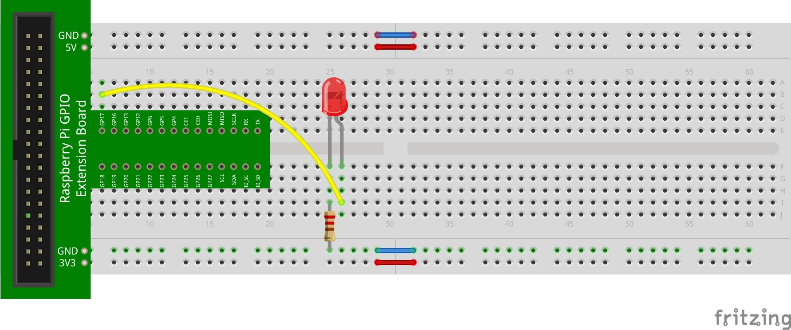
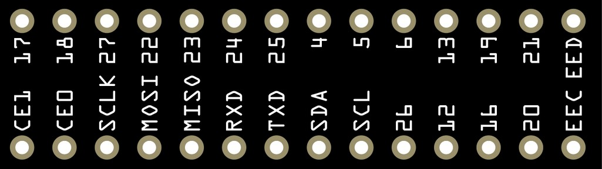

## Programmable Output

The previous circuits in this activity have been entirely external to the RPi. That is, the RPi was only used as a power source (basically, a battery). There are many more GPIO pins than the ones we have used so far (3.3V, 5V, and ground). In fact, many of the GPIO pins can be used to provide sensor input to the RPi. Others can be used to provide output capabilities from the RPi. For example, we can programmatically detect when a switch is closed and trigger an LED to light.

But before we can get to this, we must first discuss how to access and manipulate the GPIO pins on the RPi in Python. Fortunately, Python has a library called `RPi.GPIO` that can be imported. This library is installed by default on the RPi. Let's start with a simple example: lighting an LED. 

Construct the following circuit (which slightly differs from the first part of this activity):


Here is one way to construct this circuit:



Note that the yellow wire connects the positive side of the LED to a GPIO pin labeled **GP17** on the GPIO interface. If you have the black GPIO interface board, the yellow wire will connect to the same physical pin location, but the pin on the GPIO interface board will be labeled **P0** instead of GP17.

## GPIO Pin Numbering

This is a good time to discuss pin numbering schemes. It turns out that there are actually three different pin numbering schemes in use with GPIO pins on the RPi:

1. The physical pin order on the RPi;
2. The numbering assigned by the manufacturer of the Broadcom chip on the RPi; and
3. An older numbering assigned by an early RPi user who developed a library called **wiringPi**.

Pins also have a name (e.g., 5V, GND, GPIO.0, etc.). Here's a table that cross-references each (and includes names of the pins):

| BCM | wPi | Name    | Physical | Physical | Name    | wPi | BCM |
|----:|----:|--------:|:--------:|:--------:|---------|-----|-----|
|     |     | 3V3     | 1        | 2        | 5V      |     |     |
| 2   | 8   | SDA.1   | 3        | 4        | 5V      |     |     |
| 3   | 9   | SCL.1   | 5        | 6        | GND     |     |     |
| 4   | 7   | GPIO.7  | 7        | 8        | TXD     | 15  | 14  |
|     |     | GND     | 9        | 10       | RXD     | 16  | 15  |
| 17  | 0   | GPIO.0  | 11       | 12       | GPIO.1  | 1   | 18  |
| 27  | 2   | GPIO.2  | 13       | 14       | GND     |     |     |
| 22  | 3   | GPIO.3  | 15       | 16       | GPIO.4  | 4   | 23  |
|     |     | 3V3     | 17       | 18       | GPIO.5  | 5   | 24  |
| 10  | 12  | MOSI    | 19       | 20       | GND     |     |     |
| 9   | 13  | MISO    | 21       | 22       | GPIO.6  | 6   | 25  |
| 11  | 14  | SCLK    | 23       | 24       | CE0     | 8   | 7   |
|     |     | GND     | 25       | 26       | CE1     | 11  | 7   |
| 0   | 30  | SDA.0   | 27       | 28       | SCL.0   | 31  | 1   |
| 5   | 21  | GPIO.21 | 29       | 30       | GND     |     |     |
| 6   | 22  | GPIO.22 | 31       | 32       | GPIO.26 | 26  | 12  |
| 13  | 23  | GPIO.23 | 33       | 34       | GND     |     |     |
| 19  | 24  | GPIO.24 | 35       | 36       | GPIO.27 | 27  | 16  |
| 26  | 25  | GPIO.25 | 37       | 38       | GPIO.28 | 28  | 20  |
|     |     | GND     | 39       | 40       | GPIO.29 | 29  | 21  |

Don't worry about understanding the names of the pins for now (although you may have noticed that they somewhat correlate with the wiringPi numbering scheme). The GPIO pin in the layout diagram above that has the yellow wire connecting to the LED is labeled GP17. The labeling on the green GPIO interface in your kit uses Broadcom (BCM in the table above). GP17 is just BCM pin 17, which cross-references to wiringPi (wPi) pin 0 and physical pin 11 on the RPi. You may need this reference chart anytime you write Python programs that make use of the GPIO pins.

Note that Python primarily uses the Broadcom (BCM) pin numbering scheme which, thankfully, matches the GPIO interface board! For those of you that have the black GPIO interface board, using this chart can easily provide a crossreference from a BCM pin to a wPi one. In this case, BCM pin 17 (GP17) matches wPi pin 0 (P0). In a Python program, we simply need to refer to BCM pin 17 to match wPi pin 0.

For reference, here's a comparison of the black GPIO interface boards labeled with both pin numbering schemes (wPi on top, and BCM on the bottom):




Note that the green GPIO interface board is labeled directly using the BCM pin numbering scheme; therefore, no crossreference is needed.

## Using `RPi.GPIO` in Python

Importing the `RPi.GPIO` library is as simple as including the following import statement (typically done at the beginning of a Python program):

```python
import RPi.GPIO as GPIO
```

To refer to GPIO pins using the Broadcom pin layout, set the mode as follows:

```python
import RPi.GPIO as GPIO

# Pin Setup
GPIO.setmode(GPIO.BCM)  # set the pin layout
```

To turn the LED on, we must first configure pin 17 (again, using the BCM pin layout) to be an output pin as follows:

```python
import RPi.GPIO as GPIO

# Pin Setup
GPIO.setmode(GPIO.BCM)  
GPIO.setup(17, GPIO.OUT)   # configure pin 17 for output
```

And finally, to turn on the LED:

```python
import RPi.GPIO as GPIO

# Pin Setup
GPIO.setmode(GPIO.BCM)  
GPIO.setup(17, GPIO.OUT)

# main
GPIO.output(17, GPIO.HIGH)  # output on 17 (turn LED on)
```

This turns the pin on by supplying it 3.3V. And that's all there is to turning on an LED! 

Turning the LED off can be done as follows (which turns the pin off by supplying it with 0V):

```python
import RPi.GPIO as GPIO

# Pin Setup
GPIO.setmode(GPIO.BCM)  
GPIO.setup(17, GPIO.OUT)

# main
GPIO.output(17, GPIO.LOW)  # MODIFIED: stop output on 17 (turn LED off)
```

::: {.callout-note}
## Did you know?
Instead of using `GPIO.HIGH` to supply 3.3V to a pin, you can use `1` or `True`. For example, the following statements are identical (i.e., they produce the same result):

```python
# Three equivalent lines of code for turning output on at pin 17
GPIO.output(17, GPIO.HIGH)
GPIO.output(17, 1)
GPIO.output(17, True)
```

Likewise, the following statements are identical and supply 0V to a pin:

```python
# Three equivalent lines of code for stopping output at pin 17
GPIO.output(17, GPIO.LOW)
GPIO.output(17, 0)
GPIO.output(17, False)
```
:::

## Blinking the LED

Now, let's try to blink the LED. This will mean doing the following:

1. Turning the output pin on.

2. Waiting some amount of time. 

3. Turning the output pin off.

4. Waiting some amount of time.

5. Starting back at step 1. 

We already know how to turn an output pin high and low. We also know how to repeat a task over and over (we can use a `while` loop!). But we'll need to introduce a small delay so that we can actually see the LED blink. To do this, we can import the `time` library and make use of its `sleep` function:

```python
# import the sleep function from the time library
from time import sleep 
```

This will allow us to introduce delays. For example, we can introduce a half second delay as follows:

```python
# An example of using sleep to wait 0.5 seconds
sleep(0.5)
```

To blink an LED with a half second delay in between each state of the LED (on or off) and blink the LED forever, we can modify our program as follows:

```python
import RPi.GPIO as GPIO
from time import sleep

# Setup the pins
GPIO.setmode(GPIO.BCM)
GPIO.setup(17, GPIO.OUT)

# Blink the led at pin 17 repeatedly.
while (True):
    GPIO.output(17, GPIO.HIGH)
    sleep(0.5)
    GPIO.output(17, GPIO.LOW)
    sleep(0.5)
```

Note that the `while` loop will go on forever (i.e., `while (True)` is never `False`!). To stop the program, we can press **Ctrl+C**. When doing so, you may notice warnings or errors. This is normal, because our program did not clean up before aborting. 

In fact, you will most likely also get errors if you try to run the program again (or another program that uses the GPIO pins). These errors are safe to ignore for now. Usually when using GPIO pins, it is recommended to clean them up so that they are reset. We won't worry about this right now.

Often, it is standard practice to assign GPIO pin numbers to meaningful variables. For example, we can assign pin 17 to the variable `LED` (since in our program it is used to control an LED). In the end, we can modify our program as follows:

```python
import RPi.GPIO as GPIO
from time import sleep

# While not required, 
# it is customary to use ALL_CAPS_SNAKE_CASE for constants
LED = 17

GPIO.setmode(GPIO.BCM)
GPIO.setup(LED, GPIO.OUT)

while (True):
    GPIO.output(LED, GPIO.HIGH)
    sleep(0.5)
    GPIO.output(LED, GPIO.LOW)
    sleep(0.5)
```
