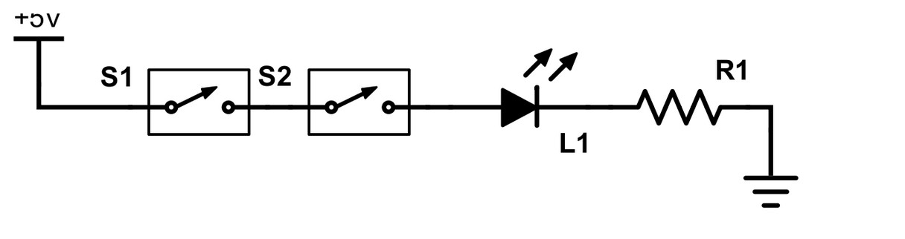
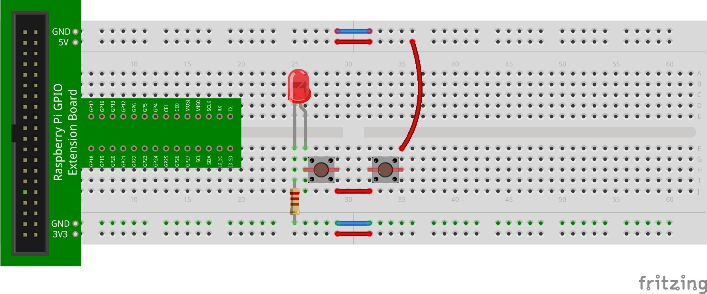
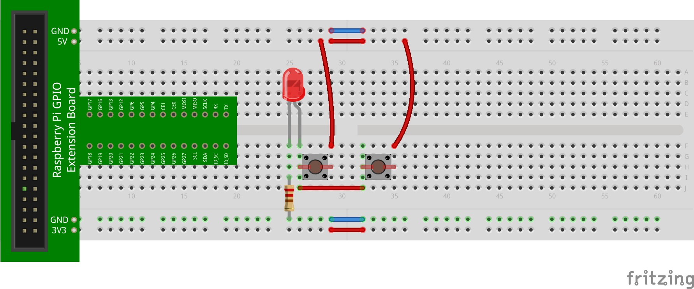

## Adding a Switch

Let's add a switch to the mix. To make this work, we want to programmatically detect the status of the switch (open or closed). If the switch is closed, then the LED should turn on; otherwise, it should remain off. To begin, implement the following circuit:


Here's one way to layout this circuit:



If you have the black GPIO interface board, layout the circuit as follows instead:


Again, the yellow wire is connected to GP17 (wPi P0) and the positive side of the LED. The green wire is connected to one side of the switch and to GP25 (wPi P6). The LED portion is unchanged from the last circuit. The only difference is the addition of a switch. One side is connected to +3.3V, and the other is connected to GP25 (wPi P6).

Detecting the state of the switch is not particularly difficult. The pin's state is first setup to be an input pin. While we're at it, we'll set a variable, `button`, to store the number of the pin (like we did with the LED above):

```python
button = 25
GPIO.setup(button, GPIO.IN)
```

In Python, input switches can be wired to positive voltage (e.g., +3.3V as in the layout diagram above) or to ground. Let's refer to the case where one pin of the switch is wired to +3.3V and the other to the input pin as **CASE 1**. By default, the input pin should be low. In fact, it should be intentionally pulled down to GND to ensure this. If the switch is open, current cannot flow to the input pin. Pressing the switch closes the circuit and allows +3.3V to flow to the input pin, thereby setting it high. The state change can be read to detect the pushing of the button!

We'll define **CASE 2** to be the case where one pin of the switch is wired to GND and the other to the input pin. In this configuration, the input pin is pulled up and actually provides current (but it has nowhere to go if the switch is not closed). Pressing the switch closes the circuit and allows current from the input pin to flow to GND. Again, the state change can be read to detect the pushing of the button.

Since both of these ways of detecting an input are possible in Python, it is standard practice to set an input pin's default state (which depends on how it is wired). We do so by either connecting the input pin (internally through our program) to 3.3V or to ground. To connect the pin to 3.3V, the RPi internally uses a **pull-up resistor** (which pulls the state of the input pin up to 3.3V). To connect the pin to ground, the RPi internally uses a **pull-down resistor** (which pulls the state of the input pin down to 0V).

Specifying a default input pin state can be done as follows:

```python
button = 25

# for case 1
GPIO.setup(button, GPIO.IN, pull_up_down=GPIO.PUD_DOWN)

# for case 2
GPIO.setup(button, GPIO.IN, pull_up_down=GPIO.PUD_UP)
```

Which you choose doesn't matter in most cases. Just make sure that you connect the other side of the switch as appropriate (e.g., to +3.3V if the input pin has a pull-down resistor and is low by default, or to ground if the input pin has a pull-up resistor and is high by default).

::: {.callout-note}
## Did you know?
You can set multiple GPIO pins either as input or output in one single statement. The method involves providing a list of the GPIO pins to the setup command as follows:

```python
out_pins = [17, 18]
in_pins = [22, 27]
GPIO.setup(out_pins, GPIO.OUT)
GPIO.output(in_pins, GPIO.IN)
```

This sets GPIO 17 and 18 as input pins and GPIO 22 and 27 as output pins. In fact, this can also be used to set all of the output pins in the output pin list (GPIO 17 and 18) as either high or low as follows:

```python
GPIO.output(out_pins, GPIO.HIGH)
```

Setting GPIO 17 high and GPIO 18 low can be done in one statement as follows:

```python
GPIO.output(out_pins, (GPIO.HIGH, GPIO.LOW))
```
:::

Reading the state of an input pin can be done as follows:

```python
if (GPIO.input(button) == GPIO.HIGH):
    ...
```

To begin, let's just display a status message that informs us whether the switch is open or closed. Here's the full Python program:

```python
import RPi.GPIO as GPIO
from time import sleep

led = 17
button = 25

GPIO.setmode(GPIO.BCM)
GPIO.setup(led, GPIO.OUT)
GPIO.setup(button, GPIO.IN, pull_up_down=GPIO.PUD_DOWN)

while (True):
    if (GPIO.input(button) == GPIO.HIGH):
        print("Closed!")
    else:
        print("Open!")
    sleep(1)
```

Try running the program. Notice that when the switch is open, "Open!" appears; otherwise, "Closed!" appears. This happens every second. Why?

To connect the switch to the LED (i.e., to make the switch control the LED), simply change the statements in the `while` loop as follows (note that the rest of the program remains unchanged). While we're at it, we can sleep a little less each time to allow the circuit to react faster to changes in the switch state:

```python
while (True):
    if (GPIO.input(button) == GPIO.HIGH):
        GPIO.output(led, GPIO.HIGH)
    else:
        GPIO.output(led, GPIO.LOW)
    sleep(0.1)
```

Detecting an input pin in this way is called **polling**. The input pin is repeatedly polled (checked) for its state. As you can see, this repeats forever and can use a lot of CPU processing time. There are better ways to detect changes in input pins that do not keep the CPU so busy; however, this will work for now.

## Two Switches (to Implement AND and OR)

Earlier, to manually implement AND and OR, two switches had to be wired either in series or parallel. Programmatically doing so precludes this. The logic can be done in Python! Let's try this by first implementing the following circuit:


Here's one way to layout this circuit:



If you have the black GPIO interface board, layout the circuit as follows instead:

The only difference in this circuit is the addition of the second switch. It is connected to +3.3V and to GP5 (wPi P21). To implement the functionality of AND (i.e., replicating two switches in series), we simply need to turn the LED on when both input pins read high. We can do this by implementing the following Python program:

```python
import RPi.GPIO as GPIO
from time import sleep

led = 17
button1 = 25
button2 = 5

GPIO.setmode(GPIO.BCM)
GPIO.setup(led, GPIO.OUT)
GPIO.setup(button1, GPIO.IN, pull_up_down=GPIO.PUD_DOWN)
GPIO.setup(button2, GPIO.IN, pull_up_down=GPIO.PUD_DOWN)

while (True):
    if (GPIO.input(button1) == GPIO.HIGH and GPIO.input(button2) == GPIO.HIGH):
        GPIO.output(led, GPIO.HIGH)
    else:
        GPIO.output(led, GPIO.LOW)
    sleep(0.1)
```

The logic is actually quite clear: the LED is turned on if both `button1` (on BCM pin 25/wPi P6) and `button2` (on BCM pin 5/wPi P21) are high. Both conditions (on the left and right of the `and` operator) must be true in order for the entire `if`-statement to be true.

Of course, implementing the OR gate is just as easy. In fact, there is no need to change the circuit! We simply switch the `and` operator with the `or` operator. The rest of the logic is exactly the same:

```python
if (GPIO.input(button1) == GPIO.HIGH or GPIO.input(button2) == GPIO.HIGH):
```



::: {.callout-note}
## Did you know? — Duty Cycle
When circuits are continuously toggled (such as when an LED is turned on and off, over and over), we can refer to the portion of time that the circuit is on as a **duty cycle**. Formally, a duty cycle is the percentage of one period in which a signal is active. A period is the time it takes for a signal to complete an on-and-off cycle. In a simple LED circuit, a duty cycle of 50% means that the LED turns on and off for the same amount of time (e.g., the LED turns on for one second, off for one second, and so on). A duty cycle of 25% means that the LED turns on 25% of the time (e.g., the LED turns on for 0.25s, off for 0.75s, and so on).
:::