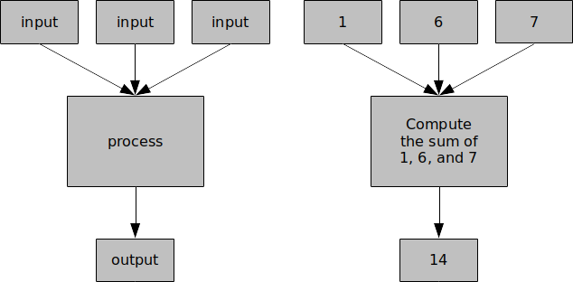

It is important to define standard ways of representing problems so that
anyone who reads about a problem can understand what it actually is.

::: {.callout-tip title="Definition"}
A **problem statement** is a formal way of defining a problem that contains
a description of the conditions at the start of the problem solving
process (also known as inputs), and a description of the valid solutions
(also referred to as outputs).
:::

For example, if a problem was to add three numbers and produce the sum,
what would the inputs be?  The answer, of course, is the three numbers!
What would the output be?  Clearly, the sum of those three numbers.  If
a problem was to determine the amount of income tax owed this year, what
would the inputs be?  Your income.  And the output?  The amount of tax
owed this year.  The following figure illustrates the sum example
(generally on the left, and specific to the sum of three numbers on the
right):

{fig-align="center"}

Consider the *producing apple pie* problem.  What would the possible
inputs for the algorithm be?  What would its valid (or correct)
output(s) be?  One way of telling if an algorithm is correct is whether
or not it produces the valid output defined in the problem statement.
If an algorithm produces blueberry pie when the output statement stated
that it was required to produce apple pie, then that algorithm is a
wrong solution.  On the other hand, if the output is an apple pie (even
if the algorithm instructs you to throw away your ingredients and then
buy an apple pie from the grocery store), then that algorithm is
technically correct (even though it may not be very *efficient*).
