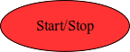
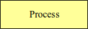
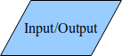
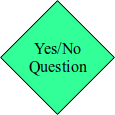

Up to this point, to-do lists have been used to represent algorithms.
There are other ways of representing algorithms, however, and one of
them is by using flowcharts.

::: {.callout-tip title="Definition"}
A **flowchart** is a type of diagram that represents an algorithm, listing
steps with various blocks and flow with arrows.
:::

Flowcharts are made up of different types of blocks, each of a different
shape.  The shapes correspond to different kinds of statements or types
of item.  Flowcharts use arrows to show the direction of execution of a
given algorithm.  An arrow leading from a block A to a block B means
that A is executed before B.

To symbolize where the algorithm starts and ends, we have a special kind
of block called the **terminal block**.  Terminal blocks are oval in shape
and identify where an algorithm starts and where it ends.  The start
block will always have one arrow leading out of it to the next block to
be executed, and the stop block will always have at least one arrow
leading into it from some previous block.  Here is what a terminal block
looks like:

{fig-align="center"}

A **process block** represents statements in which some action is performed.
It is shaped like a rectangle.  Typically, this block will have one
arrow leading into it from a block that was executed before.  It will
also have an arrow leading out of it to the block that should be
executed next.  Here is what a process block looks like:

{fig-align="center"}

An input/output block is shaped like a parallelogram.  These blocks are
used whenever an algorithm requires an input or produces an output.
Similar to the process block, this block will have an arrow leading to
it from a previous block, and an arrow leading out of it to the next
block.  Here is what an input/output block looks like:

{fig-align="center"}

Here is a possible flowchart that represents the solution to the get
dressed algorithm:

{fig-align="center"}

Are there any weaknesses with this algorithm?  Will it always work and
produce the desired output?  For example, will it work if someone
already has underwear on?  The current algorithm would force the person
already wearing underwear to put on a second one.  What would happen if
the shirt they found was dirty, but they wanted to wear clean clothes
instead?  This algorithm would force the person to wear the dirty
clothes.

These are examples of scenarios that call for *decisions* to be made and
instructions to be decided on that are executed based on answers to
simple questions.  For example, skipping the *put on underwear* step would
be useful if the person already had underwear on.  Perhaps adding a step
*find clean shirt* to the algorithm would handle the case that an original
shirt is dirty.

It is difficult to handle these decisions in a traditional to-do list,
but flowcharts deal with them in a pretty neat way by using **decision
blocks**.  Decision blocks are diamond-shaped and typically contain a
question with a yes or no answer.  Similar to the previous blocks, the
decision block will have one arrow leading into it from the preceding
block.  However, decision blocks can have two arrows leading out that go
to two different blocks.  One of those blocks is executed if the answer
to the question posed in the decision block is *yes*, and the other block
is executed if the answer is *no*.  Here is what a decision block looks
like:

{fig-align="center"}

Let's look at an improved flowchart for the get dressed algorithm that
has a decision block.  A possible solution is:

{fig-align="center"}

One of the great things about decision blocks (and flowcharts in
general) is that you can have different control flows based on decisions
made by the algorithm.  The algorithm doesn't always have to behave the
same way and can actually change its behavior based on what is happening
during its execution.  The algorithm designer, however, has to think up
all possible scenarios and cater for them when designing an algorithm.

::: {.callout-important title="Activity" collapse=false}
Design a flowchart for the *eat breakfast* algorithm.  This time, add a
decision block with the question *am I satisfied?* in an appropriate
position, such that the algorithm will always ensure that the person
eating breakfast only stops eating once satisfied.
:::
