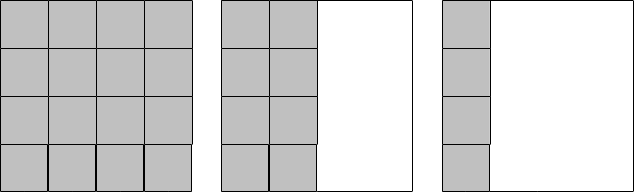

It is sometimes useful to measure and predict the time a computer takes
to execute an algorithm.  This can help us to compare several solutions
to a problem and pick the fastest one, for example.

::: {.callout-tip title="Definition"}
**Runtime** is the time that a computer takes to execute an algorithm.
:::

Most of the algorithms that we have previously considered execute all of
their statements once.  As a result, they would not take long to be
executed by a typical computer (i.e., their runtime would be low).
However, algorithms that require repetition have a longer runtime.
Consider the *find all prime numbers* algorithm.  If it was adjusted to
find all the prime numbers below 100, it would take considerably longer
than if it was set to find all the prime numbers below 10.  It would
take even longer to find all the prime numbers below 1,000.  This is
because the *check if prime* process is evaluated for every prime number
candidate, and each time it is evaluated the runtime increases.

It is typically desired to design algorithms that have as short of a
runtime as possible.  Sometimes this calls for designing more intricate
or complicated ones; however, only as long as we are sure that the
complicated algorithm will have a shorter runtime than the basic
algorithm.

Let's take a look at an interesting problem that will help to show the
differences between an algorithm that works and an algorithm that works
and is *efficient*.  Consider a square room and an unlimited number of
identical square tiles.  Can an algorithm be designed to calculate the
number of tiles required to cover the entire floor of the room?

There are several ways that this algorithm can be designed.

- One approach is to lay down tiles in the entire room and then count them.

- Another approach may be to lay down tiles in half of the room, count the
number of tiles used, and then double that number.

- A third approach may be to lay tiles along one edge of the floor, and
multiply the number of tiles laid by itself (i.e., squaring it to find
the area of the floor).

The following figure shows the three methods, side-by-side.

{fig-align="center"}

Which solution do you think is the best?  What does *best* mean?  Does it
mean that the algorithm takes less time?  Does it mean that it requires
fewer tiles?  Does it mean that it requires fewer calculations (and is
perhaps less prone to arithmetic errors)?  Is there a solution that does
not require laying down any tiles at all?

Having multiple solutions (or algorithms) to the same problem is a
frequent scenario in computer science.  We have mentioned before that
best is a very subjective measure for an algorithm.  However, there is
still a need to compare algorithms and determine which algorithm is
better.  One of the ways of **quantitatively** (i.e., numerically) comparing
is by using the algorithm's runtime.  Let's take a closer look at some
algorithms that solve the tile laying problem.  For simplicity, we will
assume that both the room and tiles are square in shape (i.e., the
number of tiles required to cover adjacent edges is equal).  Note that
the algorithm steps are numbered, with sub-steps placed within a single
algorithm.

Algorithm 1 (this one covers the entire floor with tiles):
```default
1. set number of tiles currently laid to 0
2. repeat the following steps until the entire floor is covered
    2.1. lay a tile on the floor
    2.2. add one to the number of tiles currently laid
3. the number of tiles currently laid is the number of tiles needed
```

Algorithm 2 (this one covers half of the floor with tiles):
```default
1. set number of tiles currently laid to 0
2. repeat the following steps until half of the floor is covered
    2.1. lay a tile on the floor
    2.2. add one to the number of tiles currently laid
3. multiply the number of tiles currently laid by 2
4. the result is the number of tiles needed
```

Algorithm 3 (this one covers the length of one wall with tiles):
```default
1. set number of tiles currently laid to 0
2. repeat the following steps until one row has been laid
    2.1. lay a tile on the floor
    2.2. add one to the number of tiles currently laid
3. multiply the number of tiles currently laid by itself
4. the result is the number of tiles needed
```

We are now going to figure out which algorithm is better between
Algorithm 1 and Algorithm 3 using their runtime.  Suppose that the room
is 12ft x 12ft and each tile is 1ft x 1ft.  Also assume that it takes 10
seconds to lay each tile.  How long will Algorithm 1 take to be
completely executed?  Since Algorithm 1 calls for tiles to be laid
across the entire room, the 12ft x 12ft room would then require 144
tiles.  Since it takes 10 seconds to lay each tile, it would then take
1,440 seconds to cover the entire room.  This is 24 minutes:

$$ 1,440 sec \times \frac{1 min}{60 sec} = 24 min$$


::: {.callout-note title="Did you know"}
**Dimensional analysis** is a nice way to work through problems with
different units (like minutes and seconds), and that require conversion
across them.  The basic idea is that values can be multiplied by
conversion (or dimensional) units that are expressed as fractions.
Those units can be canceled out if they appear in both the numerator and
denominator.  The example above can be rewritten as follows:

$$ \frac{1,440 sec}{1} \times \frac{1 min}{60 sec} = 24 min$$

The *sec* units in the numerator of the first fraction and the denominator
of the second fraction cancel each other out, thereby leaving *min* as the
final unit.  Here's another example that converts days to seconds:

$$ \frac{1 day}{1} \times \frac{24 hr}{1 day} \times \frac{60 min}{1 hr}
\times \frac{60 sec}{1 min} = 86,400 sec$$

The day, hr, and min units in the numerator and denominator of the
fractions cancel each other out.  The only unit left is sec which, once
the numerators and denominators are multiplied, represent the number of
seconds in one day.
:::

What about Algorithm 3?  This algorithm only calls for laying down tiles
along one edge of the room to make one row.  This means that only 12
tiles will be laid down using this algorithm, a process that would take
120 sec (2 min).  But Algorithm 3 also requires a calculation.  Let's
assume that this calculation takes 60 sec.  The total runtime for
Algorithm 3 is then 120 sec + 60 sec = 180 sec (3 min).

So Algorithm 3 is 21 minutes faster than Algorithm 1 for a 12ft x 12ft
room.  But what happens if the size of the room is changed?  What is the
performance of both algorithms if they were used to tile a room that is
20ft x 20ft, under the same timing assumptions as before?

We find that Algorithm 1 takes approximately 1 hr 7 min:

$$ \frac{400 tiles}{1} \times \frac{10 sec}{1 tile} = 4,000 sec $$
$$ \frac{400 sec}{1} \times \frac{1 sec}{60 sec} \times \frac{1 hr}{60
min} = 1.11 hr $$
$$ \frac{0.11 hr}{1} \times \frac{60 min}{1 hr} = 6.6 min $$
$$ \frac{0.6 min}{1} \times \frac{60 sec}{1 min} = 36 sec $$

Let's explain the calculations above.

- The first calculates the number of seconds required for Algorithm 1:
4,000 sec.

- To represent this in hr, min, and sec, we simply need to convert 4,000
sec to hr (the second calculation): 1.11 hr.

- The third calculation takes the fractional portion of this (0.11 hr) and
converts it to min: 6.6 min.

- The final calculation takes the fractional portion of this (0.6 min) and
converts it to sec: 36 sec.  The total time is then 1 hr 6 min 36 sec,
or approximately 1 hr 7 min.

Algorithm 3 only takes approximately 4.5 minutes:

$$ \frac{20 tiles}{1} \times \frac{10 sec}{1 tile} = 200 sec + 60 sec =
260 sec$$
$$\frac{260 sec}{1} \times \frac{1 min}{60 sec} = 4.33 min$$
$$\frac{0.33 min}{1} * \frac{60 sec}{1 min} = 19.8 sec$$

Again,

- The first calculation gives us the time it takes to lay tiles across a
  single wall, and then do the 60 sec calculation: 260 sec.

- The second calculation converts sec to min.

- The final calculation takes the fractional portion of this (0.33 min) and converts it to
  sec: 19.8 sec.

The total time is then 4 min 19.8 sec, or approximately 4.5 min.

This means Algorithm 3 is over 15 times faster than Algorithm 1 for a 20ft x 20ft room:
$$ \frac{4,000 sec}{260 sec} = 15.38$$

Does that mean that Algorithm 3 will always be faster and therefore
better than Algorithm 1?

::: {.callout-important title="Activity" collapse=true}
Try calculating and comparing how long it will take for either algorithm
to cover a very small room that is 2ft x 2ft.
:::

What about if the room was 3ft x 3ft?  In this case, we find that both
algorithms take the same amount of time.  The calculation for Algorithm
1:

$$ \frac{9 tiles}{1} \times \frac{10 sec}{1 tile} = 90 sec$$

The calculation for Algorithm 3:

$$ \frac{3 tiles}{1} \times \frac{10 sec}{1 tile} = 30 sec + 60 sec = 90
sec$$

The question of which algorithm is better depends on the size of the
room to be tiled. @fig-algorithm-runtime compares the runtime of
the two algorithms on differently sized rooms.  It is a plot in which
the horizontal axis represents the length of one wall of the room (in
feet), and the vertical axis represents the amount of time that is
required to tile the room (in seconds).  The figure illustrates that for
rooms less than 3ft x 3ft, Algorithm 1 is faster.  In the case where the
room is exactly 3 ft x 3 ft both algorithms require the same amount of
time.  For rooms greater than 3ft x 3ft, Algorithm 3 is faster.


```{ojs}
//| echo: false
//| label: fig-algorithm-runtime
//| fig-cap: Algorithm performance on rooms of various sizes

// define data values
tile_time = 10   // time to lay one tile
calc_time = 60   // time to make a calculation
wall_length = d3.range(10)  // X-axis points

// calculate the runtime for the two algorithms (Y-axis points)
alg_data = wall_length.flatMap(x => [
{ wall: x, runtime: (x ** 2) * tile_time, algorithm: "Algorithm 1" },
{ wall: x, runtime: x * tile_time + calc_time, algorithm: "Algorithm 3" }
])

// Plot the two line graphs with labels
Plot.plot({
    x: { label: "Wall Length in feet" },
    y: { label: "Runtime in seconds" },
    color: { legend: true },
    marks: [
        Plot.line(alg_data, { x: "wall", y: "runtime", stroke: "algorithm" })
    ]
})

```
