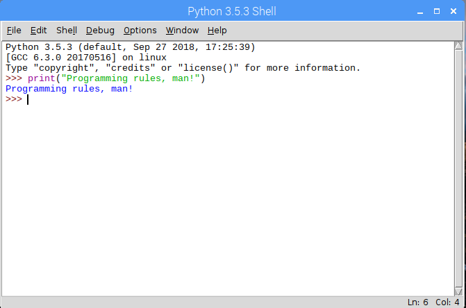
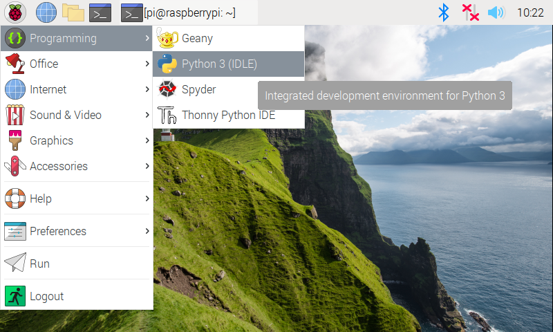
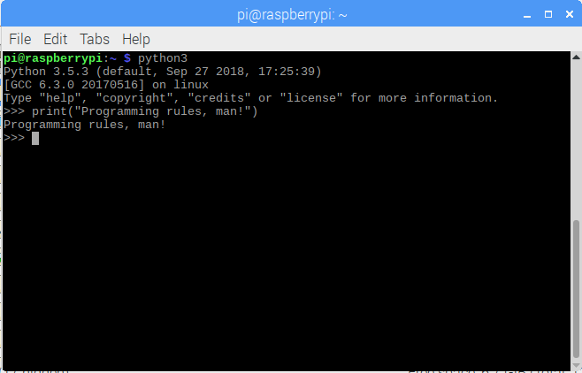

Many programmers write their programs in a general purpose programming
language using nothing but a text-based editor (usually a simplistic
one, albeit with useful characteristics such as syntax highlighting). In
fact, some write programs at the command line (in the terminal) using
nothing but a text-based text editor (i.e., without graphical
characteristics). Most programmers, however, use an IDE (Integrated
Development Environment).

::: {.callout-tip title="Definition"}
An **Integrated Development Environment (IDE)** is a piece of software that
allows computer programmers to design, execute, and debug computer
programs in an integrated and flexible manner.
:::

On the Raspberry Pi, the IDE used to design Python programs is called
IDLE (which stands for Python's **I**ntegrated **D**eve**L**opment **E**nvironment).
Other IDEs exist for pretty much all of the most used general purpose
programming languages: Eclipse, Visual Studio, Code::Blocks, NetBeans,
Dev-C++, Xcode, and so on.  In fact, many of these IDEs support more
than one language (some natively, others by installing additional
plug-ins or modules)!  Here's an image of IDLE with the program shown
earlier implemented (and executed):

On the Raspberry Pi, IDLE can be launched as follows:

Python programs can also be created and executed at the command line (or
terminal).  We do so by launching a terminal and typing **python**, which
brings up the Python shell:

::: {.callout-note title="Did you know" .column-margin}
On computers that have two alternate versions of python installed on
them, you might have to type **python3** as the command to open up a
python shell like the one in the image.
:::
