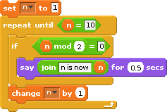

Earlier in this lesson, you learned that programs written in a
programming language are either compiled (to machine language so that a
computer can execute them directly) or interpreted,
statement-by-statement (in a sense, you could say that programs written
in interpreted languages are compiled, line-by-line, in real time).
Python is an interpreted language that implements the imperative
paradigm.  That is, programs are designed as a sequence of instructions
(called statements) that can be followed to complete a task.

Let's take a look at a simple program in Scratch and see how it compares
to the same thing in Python:



What does this program do?  Simply put, it displays the numbers 2, 4, 6,
and 8.  Take a look at the script above.  The variable *n* is initially
set to 1.  A *repeat-until* loop is executed so long as *n* is less than
10 (i.e., 1 through 9).  Each time the body of the loop is executed, the
string "n is now (plus the value of n)" is displayed if *n* is evenly
divisible by 2.  For example, if *n* is 4, then the string **n is now
4** is displayed.  Recall that the *mod* operator returns the remainder
of a division.  Therefore, when **n mod 2 = 0** is true, it means that
the remainder of *n* divided by 2 is zero – so *n* must be even!  At the
end of the body of the loop, the variable *n* is incremented (ensuring
that *n* will eventually reach the value 10, and we will break out of
the *repeat-until* loop).

Here's how this can be similarly done in Python:

```python
n = 1
while n < 10:
    if n % 2 == 0:
	    print("n is now " + str(n))
    n = n + 1
```

At this point, it is fine if you don't understand everything that's
going on syntactically.  The idea is simply to illustrate how Scratch
and Python differ (and are similar!).  But let's try to explain.

- The block, *set n to 1*, in Scratch is implemented in Python as, `n =
1`.  Pretty similar!

- Python has no *repeat-until* repetition construct.  Instead, we can
  use a *while* construct with a modified condition.  Repeating a task
  until a variable (in this case, *n*) is 10 is the same thing as
  repeating it while the variable is less than 10.

- If-statements are similar; however, the *mod* and *equality* operators
  differ.  In Python, we check for equality using the double-equal (==)
  operator.  The mod operator is a percent sign (%).  So the block, *if
  n mod 2 = 0*, in Scratch can be implemented in Python as, `if n % 2 ==
  0`.

- Generating the output, "n is now 4," for example, can be implemented
  in Scratch using the familiar print statement: `print ("n is now 4")`.
  Of course, we don't always want to display the literal string "n is 4".  So we
  concatenate (or join) the value of *n* to the string "n is now " just
  as we did in Scratch.  However, since *n* is not a string of
  characters (i.e., it is a number – an integer to be precise), then it
  must first be converted to a string before being concatenated to
  another string.  This is what `str(n)` does.

- Finally, the value of *n* is incremented by 1 with the statement *n =
  n + 1*.

In Scratch, it is easy to see the blocks that belong in the body of a
repetition construct.  The puzzle pieces intrinsically capture this
(i.e., they are quite literally visible inside the *repeat-until* block in
the script above).  In Python, we denote statement hierarchy (i.e., if
statements belong in the body of a construct such as a *while* loop) by
using **indentation**.  Note how it is quite clear which statements belong
in the body of the *while* loop above: the if-statement and the statement
that increments the variable *n* by 1.  Note that the *print* statement is
inside the true part of the if-statement (this is evident by how it is
directly beneath the if-statement and indented further to the right).
Again, at this point it is fine to have a minimal grasp of Python's
syntax.
