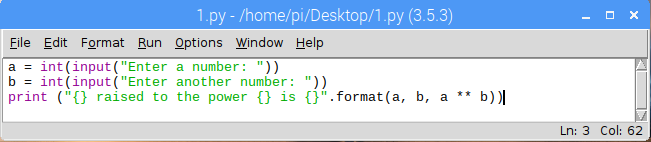
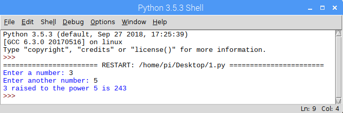
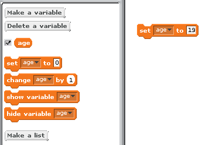
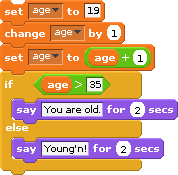
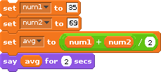
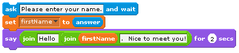
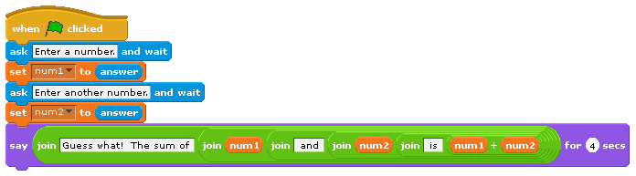

::: {.callout-important title="Activity" collapse=true}
Open your IDE of choice (e.g. IDLE) and follow along with the professor
as they try out different code snippets in the python shell. This
activity should give you an idea of

- the kinds of operators and expressions that are possible  in the
  python shell.

- how to execute print statements consisting of different kinds of data

- how to prompt the user for some input in the middle of code execution

- storing values in variables

- using variables and the values stored within as part of other
  expressions.
:::

You should be able to understand every single statement in the snippet
below and even create a similar sequence on your own with a clear grasp
of what each statement is doing.

```python
a = 10
b = 15
print(f"{a} ^ {b} = {a**b}")
print(a + 6)
c = input("What is your name?")
print(f"Hello {c}")
d = input(f"so {c}, How old are you?")
e = int(d)
print(f"You are {e} years old and you will be 100 in {100-e} years")
```

### Creating Programs and Saving Files

So far, we have been entering statements in the Python shell.  These
statements have been interpreted, one at a time.  If we were to close
the Python shell, everything that we entered would be lost.  In order to
save Python programs, we must type them in a separate editor outside of
the Python shell, save them in a file.  Once this has been done, we can
then execute them in the Python shell.

To create a new Python program, click on **File | New File** (or press
**Ctrl+N**) in the Python shell.  This brings up a new window (an editor
that is a part of IDLE) in which we can type our program.  Type the
following program into this new window:

```python
a = int(input("Enter a number: "))
b = int(input("Enter another number: "))
print(f"{a} raised to the power {b} is {a**b}")
```

If you are using IDLE, this is what your window should look like.



::: {.callout-note title="Did you know" .column-margin}
Note that when editing a python file, there will NOT be any **>>>**
symbols on the left of your lines of code. If you see those symbols,
that means you are still within the shell and not in an actual python
file.
:::

Before we can run this program, it must be saved.  Do so by clicking on
**File | Save** (or press **Ctrl+S**).  Give it an appropriate name, and save it
to an appropriate location.  Now it can be executed by clicking on **Run |
Run Module** (or by pressing **F5**).  This executes the program in the Python
shell:



You can run your code any number of times by selecting **Run | Run
Module** (or pressing F5). If your code requires some input from the
user, each execution affords you an opportunity to try out different
input options e.g. inputing different numbers to see what one raised to
another is.

### Reloading a saved file

To load a saved Python program, simply double-click on the saved file.
This should bring up the **IDLE** editor with your file loaded in it.
Sometimes, double-clicking on the file just opens it up in a notepad-
like editor by default. To force it to open in IDLE, right-click the
file instead, and select **Open with IDLE**.

The program can then be executed as before, by clicking on **Run | Run
Module** (or by pressing F5). This will automatically open a Python shell
and execute the program.

::: {.callout-important title="Activity" collapse=true}
Write a python program that prompts the user for two numbers and
displays the quotient and remainder when the first number is divided by
the second. As an example, if the user typed in 17 and 3 for the first
and second number respectively, it would output a result similar to the
one shown below.


> The quotient of 17 divided by 3 is 5 with a remainder of 2

:::

### Data types, constants, and variables

::: {.callout-tip title="Definition"}
The kinds of values that can be expressed in a programming language are
known as its **data types**
:::

Recall that Scratch supports only two data types: text and numbers.
Since Python is a general purpose programming language, it supports many
more data types. Actually, it can support virtually any type that you
can think of! That is, Python allows you to define your own type for use
in whatever way you wish. Since this is user-defined, let's focus on
what are called primitive types for now.

::: {.callout-tip title="Definition"}
The **primitive types** of a programming language are those data types that
are built-in (or standard) to the language and typically considered as
basic building blocks (i.e., more complex types can be created from
these primitive types).
:::

Python's standard types can be grouped into several classes: numeric
types, sequences, sets, and mappings. Although there are actually
others, we will focus on these in the *Living with Cyber* curriculum.

Numeric types include whole numbers, floating point numbers, and complex
numbers. Python has two whole number types: `int` and `long`. The `int` data
type is a 64-bit integer. This means that 64 bits (i.e. a bit can be
either 0 or 1) is used to represent a single whole number. For example
the following series of bits represent a single integer (in fact it
represents the number 846,251,337): 0000 0000 0000 0000 0000 0000 0000
0000 0011 0010 0111 0000 1100 0101 0100 1001. We will explore this in
more detail at a later time. The `long` data type is an integer of
unlimited length. This means Python will give us enough bits to store
any number we want! Note that in Python 3.x, an `int` is an integer of
unlimited length (there is no long data type). These integer types can
represent negative or positive whole numbers. The `float` type is a 64-bit
floating point (decimal) number. This means it can hold numbers like
3.14 and -90.3324235. Lastly, the `complex` type represents complex
numbers (i.e., numbers with real and imaginary parts). Most of our
programs will require only `int` and `float`.

So what does this all mean? We create variables that contain data of
some data type. Knowing the data type of a variable is like knowing the
superpowers of a person you can control. In this analogy, the
superpowers of a data type are the methods and properties that can be
leveraged for use in whatever program you are writing at the time. For
example, one of the superpowers of the numeric data types is raising
them to a power. To do that, we can use the function of the form
`pow(x,y)`. In this example, *x* and *y* are variables that are of type
`int` or
`float`. The **pow** function returns the value of the computation involving
raising the value in x to the power of the value in y (i.e., x^y^ ). This
function would not typically be able to work for variables that aren't
numeric data types. You may recall that the same functionality can be
implemented in Python as: `x ** y`. This effectively performs the same
thing.

::: {.callout-tip title="Definition"}
A **constant** is defined as a value of a particular type that does not
change over time.
:::

In Python (just as in Scratch), both numbers and text may be expressed
as constants. **Numeric constants** are composed of the digits 0 through
9 and, optionally, a negative sign (for negative numbers), and a decimal
point (for floating point numbers). For example, the number -3.14159 is
a numeric constant in Python.

A text constant consists of a sequence of characters (also known as a
string of characters – or just a string). The following are examples of
valid string constants:

- "A man, a plan, a canal, Panama."
- "Was it Eliot's toilet I saw?"
- "There are 10 kinds of people in this world. Those who know binary,
  those who don't, and those who didn't know it was in base 3!"

Note that, unlike Scratch, Python requires the quotes surrounding text
constants.

::: {.callout-tip title="Definition"}
A **variable** is a named object that can store a value of a particular
data type.
:::

Recall that Scratch supports two types of variables: text variables and
numeric variables. Moreover, before a variable can be used, its name
must be declared. In many programming languages, both its name and type
must be declared; however, both Scratch and Python only require a
variable's name to be declared before it is used. Here is an example of
declaring and initializing a variable in Python compared to the process
in Scratch.

:::{layout-ncol=2}



```python
age = 19
```

:::


Here are some examples that deal with variables and how they compare in
Scratch and Python:

:::{layout-ncol=2}



```python
age = 19
age = age + 1
age = age + 1
if (age > 35):
    print("You are old.")
else:
    print("Young'n!")
```



```python
num1 = 35
num2 = 69
avg = (num1 + num2) / 2.0
print(avg)
```
:::

In short, to declare variables in Python, we simply write a statement
that assigns a value to a variable name. Note that, just as in Scratch,
we can assign a value of a different type to a variable. For example:

```python
var = 5
print(var)
var = 3.14159
print(var)
var = "Pi"
print(var)
```

It is important to realize that, while human programmers generally try
to give variables names that reflect the use to which they will be put,
the variable name itself doesn't mean anything to the computer.  For
example, the numeric variable `age` can be used to hold any number, not
just an age. It is perfectly legal for `age` to hold the number of
students in a class or the number of eggs in your refrigerator. The
computer couldn't care less. Human programmers, on the other hand,
generally care a great deal. They expect a variable's name to accurately
reflect its purpose; so while it is possible to do so, it would be
considered poor programming practice to use the variable `age` to store
anything other than an age.

### Input and Output

In order for a computer program to perform any useful work, it must be
able to communicate with the outside world. The process of communicating
with the outside world is known as input/output (or I/O).  Most
imperative languages include mechanisms for performing other kinds of
I/O such as detecting where the mouse is pointing and accessing the
contents of a disk drive.

The flexibility and power that input statements give programming
languages cannot be overstated.  Without them the only way to get a
program to change its output would be to modify the program code itself,
which is something that a typical user cannot be expected to do.

General-purpose programming languages allow human programmers to
construct programs that do amazing things. When attempting to understand
what a program does, however, it is vitally important to always keep in
mind that the computer does not comprehend the meaning of the character
strings it manipulates or the significance of the calculations it
performs. Take, for example, the following simple Scratch program:



This program simply displays strings of characters, stores user input,
and echoes that input back to the screen along with some additional
character strings. The computer has no clue what the text string "Please
enter your name: " means. For all it cares, the string could have been
"My hovercraft is full of eels." or "qwerty uiop asdf ghjkl;" (or any
other text string for that matter). Its only concern is to copy the
characters of the text string onto the display screen.

Only in the minds of human beings do the sequence of characters "Please
enter your name: " take on meaning. If this seems odd, try to remember
that comprehension does not even occur in the minds of all humans, only
those who are capable of reading and understanding written English. A
four year old, for example, would not know how to respond to this prompt
because he or she would be unable to read it.  This is so despite the
fact that if you were to ask the child his or her name, he or she could
immediately respond and perhaps even type it out on the keyboard for
you.

Now consider this Scratch program:



Here, the input is numeric instead of text. The program prompts the user
for two numbers, which it then computes the sum for and displays to the
user. Note that two variables were declared: `num1` and `num2`.  The
first number is captured and stored in the variable `num1`. The
second number is captured and stored in the variable `num2`. What do
you think would happen if the user did not provide numeric input
and, for example, inputted "Bob" for the first number? In the *real
world*, programmers must create robust programs that examine user
input in order to verify that it is of the proper type before
processing that input. If the input is found to be in error, the
program must take appropriate corrective action, such as rejecting
the invalid input and requesting the user try again.

In Python, output is implemented as a **print** statement:

```python
print("This is some output!")
```

We use the **input** statement to ask a question and obtain user input.
In the same statement, we can assign the result of this to a variable:

```python
age = int(input("How old are you? "))
```

Of course, we need to take care to properly specify whether the input is
numeric or text (in Python 3.x its a text by default. Use casting to
convert into numeric).

### Expressions and assignment

You've seen how to assign values to variables above using a simple
assignment statement. For example:

```python
name = "Shonda Lear"
age = 19
grade = 91.76
letter_grade = "A"
```

These are all examples of assignment statements. In this configuration,
the equal sign (=) functions as the assignment operator. Later, you will
see how it can also be used to compare values or expressions.

::: {.callout-tip title="Definition"}
An **expression** in a programming language is some combination of
values (e.g., constants and variables) that are evaluated to produce
some new value.
:::

For example, a simple expression in Python is `1 + 2`. The result of this
expression is, of course, `3`!  Expressions usually take on the form of
*operand operator operand*. In the previous example, the operator was
`+` and the operands were `1` and `2`. The operator `+` has a very well defined
behavior on operands of numeric types: it simply adds them. On string
types, it concatenates.

::: {.callout-important title="Activity" collapse=true}
What do you think would happen if the operands are of two different
types (e.g., numeric and string)? Try out the statements below and see
if you can understand the output that you get.
```python
print(1 + "one")
print("one" + 1)
print("1" + "1")
print(1 + "1")
print(1 + 1)
print("one" + str(1))
print(1 + int("1"))
```
:::

The activity above should have demonstrated that Python doesn't know
what it means to "add" a numeric type to a string type. Therefore, it
results in an error: unsupported operand type(s). To "add" a string type
to a numeric type, we must convert the numeric type to a string type via
`str`. Then, Python understands that "adding" actually means concatenating
two strings. It is interesting to note how Python handles "multiplying"
a string type and a numeric type like this:

```python
print("hello" * 5)
```

It turns out that Python understands how to "multiply" both types by
interpreting the `*` operator as concatenating a string type a number of
times specified by a numeric type.

```python
print("Baby Shark")
print("doo " * 6)
```

Python has many different operators that perform a variety of operations
on operands. These will be discussed later in this lesson.
