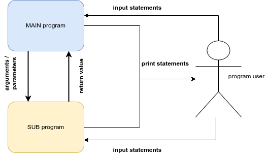

::: {.callout-tip title="Definition"}
A **subprogram** is a block or segment of organized, reusable, and related
statements that perform some action.
:::

It is essentially a program within a program. Recall an earlier lesson
on representing algorithms as to-do lists. One algorithm represented the
steps necessary to *get to class*. One of those steps was *eat
breakfast*.  We noted how we could zoom in to that step and identify the
sub-steps necessary to complete the *eat breakfast* step. Control flow
shifted from the main to-do list to the *eat breakfast* to-do list when
the *eat breakfast* step was encountered, and then returned to the main
to-do list at the point where it left earlier. We can consider the *eat
breakfast* to-do list as a subprogram.

Very few *real* programs are written as one long piece of code. Instead,
traditional imperative programs generally consist of large numbers of
relatively simple subprograms that work together to accomplish some
complex task. While it is theoretically possible to write large programs
without the use of subprograms, as a practical matter any significant
program must be decomposed into manageable pieces if humans are to write
and maintain it.

Subprograms make the construction of software libraries possible.

::: {.callout-tip title="Definition"}
A **software library** (or just **library**) is a collection of subprograms, or
routines as they are sometimes called, for solving common problems that
have been written, tested, and debugged.
:::

Most programming languages come with extensive libraries for performing
mathematical and text string operations and for building graphical user
interfaces. These languages allow programmers to include library
routines in their code. Using subprograms from the library speeds up the
software development process and results in a more reliable finished
product.

When a subprogram is invoked, or called, from within a program, the
*calling* program pauses temporarily so that the *called* subprogram can
carry out its actions. Eventually, the called subprogram will complete
its task and control will once again return to the *caller*. When this
occurs, the calling program *wakes up* and resumes its execution from the
point it was at when the call took place.

Subprograms can call other subprograms (including copies of themselves
as we will see later). These subprograms can, in turn, call other
subprograms. This chain of subprogram invocations can extend to an
arbitrary depth as long as the *bottom* of the chain is eventually
reached. It is necessary that infinite calling sequences be avoided,
since each subprogram in the chain of subprogram invocations must
eventually complete its task and return control to the program that
called it.

Subprograms are broken down into two types: methods and functions.

::: {.callout-tip title="Definition"}
A **method** is a subprogram that performs an action and returns flow of
control to the point at which it was called. A **function** is similar;
however, it returns some sort of value before flow of control is
transferred back to the point at which it was called.
:::

For example, a method may simply display some useful information about a
program to the user (e.g., a program's help menu), while a function may
compute some numeric value and return it to the user.  Subprograms in
Python are generally just referred to as functions, regardless of
whether or not they return a value. For the remainder of this lesson, we
will refer to subprograms as functions.

In Python, functions must formally be declared prior to their use. That
is, the body or content of a function must be specified in a program
before it can be called. The syntax for declaring a function is as
follows:

```python
def function_name(optional_parameters):
    function_body
```

The keyword **def** is a reserved word in Python and is used to declare
functions. A function name can be any valid identifier. As you will see
later, an **identifier** is a name used to identify a variable, function, or
other object (note that objects will be discussed later). The function
name must be followed by a set of parentheses containing optional
parameters.

::: {.callout-tip title="Definition"}
**Parameters** allow for values (constants, variables, expressions, and so
on) to be passed in to a function. They form the input needed for the
function to execute properly.
:::

For example, a function may accept two values, calculate their average,
and return the result to the caller. The function **definition** (or
**header**) is terminated with a colon (`:`). The **body** of a function
(i.e., its enclosed statements) is indented.

Here is an example of a simple function that displays a line of text:

```python
def sayHelloWorld():
    print("Hello World!")
```

This function is called `sayHelloWorld` and takes no parameters. It simply displays the text, "Hello
world!"

Once its been defined, we can then progress to using this function as
many times as we'd like. To call this function, we simply need to
specify its name and the values of its parameters (if any) as follows:

```python
sayHelloWorld()
```

Or if we want to call it multiple times:

```python
sayHelloWorld()
sayHelloWorld()
sayHelloWorld()
```

Formally, functions have a **header** and a **body**. The header is the
statement that defines the function (i.e., with the def keyword). The
header of a function is often called its **signature**, and provides its
name and any parameters. Function parameters help a function complete
its task by providing input values. In fact, each call to a function
possibly means a new set of parameters. The body of a function describes
what the function does. This is the code within the function. Some
functions compute and return a result, called the **return value**, that is
returned via the **return** keyword.

Here's a function that accepts two parameters and calculates (and
returns) the average of the two:

```python
def average(a, b):
    return (a + b) / 2
```

And here are some examples of how it could be called:

```python
a = average(5, 11)
b = average(4, 6)
c = average(22, 21)
print(f"a = {a}, b = {b}, c = {c}")
```

Note the **return** keyword. Its purpose is to return whatever
expression comes after it. The statement `return (a + b) / 2` returns
the result of the expression `(a + b) / 2` to the caller (one of which
happened at the statement `average(5, 11)`).

Here's a pow function that returns the exponentiation of one parameter
by another:

```python
def pow(x, y):
    return x ** y
```

Recall that `x ** y` in Python implies exponentiation and means *x*
raised to the power *y*. Formally, we call `**` the exponentiation
operator.  Operators will be discussed in detail in the next section.

Here's sample output of this function with various parameters:

```python
a = pow(2, 8)
b = pow(10, 4)
c = pow(3, 5)
print(f"a = {a}, b = {b}, c = {c}")
```


::: {.callout-important title="Activity" collapse=true}
See how many of the following subprograms you can design and use.
```python
double(x)			# a function to return double of the argument it receives
power(x, y)			# a function to return the result of x raised to the
				    # power of y
average(x, y, z)	# return the average of its arguments
concat(a, b)		# a function to return a string concatenation of its
				    # arguments
isin(a, b)			# a function to tell whether the string a is a part of b
max(x, y)			# return the larger of two values
iseven(x)			# return a whether the argument is even or not
squarenum(x)		# return square of its argument
cubenum(x)			# return cube of its argument
divide(x, y)		# return the quotient of x and y
factorial(x)		# return the result of x!
isprime(x)			# return whether x is a prime number or not
countvowels(a)		# return number of vowels in a string
fibonacci(x)		# return the xth fibonacci number
celstofahr(x)		# change a temperature from celsius to fahrenheit
lbstokgs(x)			# change pounds to kilograms
```

Recall that *designing* and *using* a function are two different parts
of working with subprograms. Make sure that you are comfortable with
tackling either part of the process.

Below are a few more programs that you can try to design and use. These
programs will not require any return statements.

```python
greet(a)			# a function to print out a greeting for the name a
printmulttable(x)	# print out all values of [1-10] * x
printstarsquare(x)	# print out a square of size x of * characters
displaymenu()		# print out the items in a fictional menu
printcurrentdate()	# print out the current date.
```

:::

@fig-argreturn should help clarify some of the terminology that
we have discussed so far that might be a little confusing.

{fig-align="center" #fig-argreturn}

**Print** statements are used to provide information to the user of
the program. They can be executed by either the main program or any
subprogram and their purpose is to produce some kind of information on
the computer screen for the user of the program.

```python
print("this only has value to the person reading this screen")
```

**Input** statements are used to gather information from the user of the
program. They can also be executed by any part of the program i.e. main
program or subprogram and their sole purpose is to *prompt* the user for
some kind of information that will be used by the program later on.

```python
x = input("I need some information from the user of this program")
```


**Arguments / Parameters** are pieces of information that a subprogram
requires to even start its execution. They can either be provided by the
main program or another subprogram. You will typically see these
arguments whenever the subprogram is being called/used. However, the
subprogram should anticipate the reception of these arguments and will
typically have a variable place holder for them.

```python
# in this example, x is the argument. The DESIGNER of the function knows
# that in order for the function to even begin, it will need some piece
# of information and they will temporarily store that information in the
# variable x
def double(x):
    ans = 2 * x
    return ans

# Once the function is defined, the DESIGNER of the main program is now in
# charge of giving a value that will be mapped to x. In the lines below,
# 5, 9, and b are the arguments that will be mapped to x over three
# different executions of the function.
a = double(5)
b = double(9)
c = double(b)

```

**Return** values are pieces of information that a subprogram wants to
give back to the main program (or another subprogram). These values are
typically the result of some kind of calculation or process. You will
find return statements at the end of a subprogram. The main program (or
subprogram) that is using the subprogram in question should anticipate
the reception of a return value by either storing it in a variable or
using the value as part of an expression.

```python
# in the code snippet above, note that ans is the value that is
# returned.
# the value actually in ans will depend on what argument was passed into
# x when the "double" function is called
```
