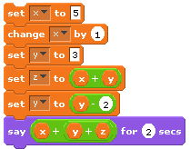
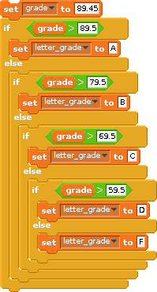
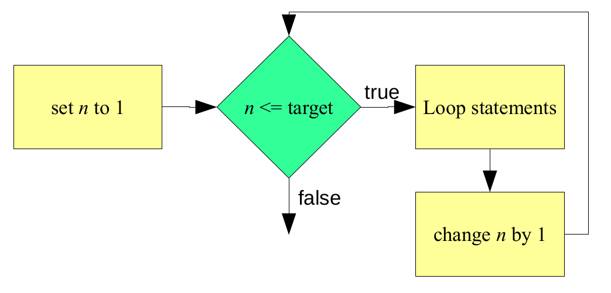
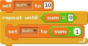

What makes computers more than simple calculating devices is their
ability to respond in different ways to different situations. In order
to create programs capable of solving more complex tasks we need to
examine how the basic instructions we have studied can be organized into
higher-level constructs.  Recall that the vast majority of imperative
programming languages support three types of control constructs which
are used to group individual statements together and specify the
conditions under which they will be executed. Again, these control
constructs are: sequence, selection, and repetition.

Recall from a previous RPi activity that **sequence** requires that the
individual statements of a program be executed one after another, in the
order that they appear in the program. Sequence is defined implicitly by
the physical order of the statements. It does not require an explicit
program structure. This is related to our previous discussion on
**control flow**.

::: {.callout-tip title="Definition"}
**Selection** constructs contain one or more blocks of statements and
specify the conditions under which the blocks should be executed.
:::

Basically, selection allows a human programmer to include within a
program one or more blocks of *optional* code along with some tests that
the program can use to determine which one of the blocks to perform.
Selection allows imperative programs to choose which particular set of
actions to perform, based on the conditions that exist at the time the
construct is encountered during program execution.

::: {.callout-tip title="Definition"}
**Repetition** constructs contain exactly one block of statements together
with a mechanism for repeating the statements within the block some
number of times.
:::

There are two major types of repetition: iteration and recursion.

**Iteration**, which is usually implemented directly in a programming
language as an explicit program structure, often involves repeating a
block of statements either:

1. while some condition is true, or

2. some fixed number of times.

**Recursion** involves a subprogram (e.g., a function) that makes
reference to itself. As with sequence, recursion does not normally have
an explicit program construct associated with it.

### Sequence

Sequence is the most basic control construct. It is the *glue* that
holds the individual statements of a program together. Yet, when
students who are new to programming try to understand how a particular
program works, they often just glance over the various statements making
up the program to get a *feel* for what it does rather than methodically
tracing through the sequence of actions it performs. One reason such an
approach is tempting is because students tend to believe they can figure
out what a program is *supposed* to do based on contextual clues such as
the meaning of variable names and character strings.

While it is often possible to gain a superficial knowledge of a program
simply by reading it, this approach will not give you the kind of
detailed understanding that is frequently required to accurately predict
a program's output. Being able to carefully trace through a program to
determine exactly what it does is an important skill. Failure to
carefully follow the sequence of instructions often leads to confusion
when trying to understand the behavior of a program.

The following Scratch program illustrates the importance of sequence. It
contains a little *do nothing* program that displays the value 16. What
makes this program interesting is not so much what its output is, as the
way in which that output is computed. Without carefully tracing through
the program, one statement at a time, it would be difficult to correctly
predict the final output generated by the program.

{fig-align="center" width=50% #fig-scratchsequence}

Note that the variables `x`, `y`, and `z` were declared in the variables
blocks group. The following illustrates the state of the program's
memory after executing each line of code. After performing the first
declaration, the program knows only about the variable `x`. After the
second declaration, it knows of `x` and `y`, and after the third, it
knows of `x`, `y`, and `z`. Since these variables have not yet been
assigned values, their values are considered to be undefined at this
point.

{fig-align="center" width=70%}

In Python, sequence is implemented in a manner very similar to Scratch:
we simply place statements in the order that we wish them to be
executed. Here's the program above in Python:

```python
x = 5
x += 1
y = 3
z = x + y
y -= 2
print(x + y + z)
```

::: {.callout-tip title="Definition"}
**Sequence** represents the natural order of statement execution. It
represents a top-down, sequential order where lines of code are
evaluated one after the other.
:::

### Selection

Selection statements give imperative languages the ability to make
choices based on the results of certain condition tests. These condition
tests take the form of **Boolean expressions**, which are expressions that
evaluate to either `True` or `False`. As discussed earlier, there are
various types of Boolean expressions, but most of the time condition
tests are based on relational operators. Recall that **relational
operators** compare two expressions of like type to determine whether
their values satisfy some criterion. Selection statements use the
results of Boolean expressions to choose which sequence of actions to
perform next. The general form of all Boolean expressions:

```
expression   relational_operator   expression
```

Both Scratch and Python support two different selection statements:
**if-else** and **if**. An *if-else* statement allows a program to make a two-way
choice based on the result of a Boolean expression. If-else
statements specify a Boolean expression and two separate blocks of
code: one that is to be executed if the expression is true, the
other to be executed if the expression is false. Recall that, in
Scratch, selection constructs contain one or more blocks of
statements and specify the conditions under which the blocks should
be executed.

Here's an example:

{fig-align="center" width=40%}

Here is an equivalent snippet of code in Python

```python
grade = 89.45
if (grade > 89.5):
    letter_grade = "A"
else:
    if (grade > 79.5):
        letter_grade = "B"
    else:
        if (grade > 69.5):
            letter_grade = "C"
        else:
            if (grade > 59.5):
                letter_grade = "D"
            else:
                letter_grade = "F"

print(f"{grade} is a/an {letter_grade}")
```

Note the structure of an if-else statement in Python:

```python
if (condition):
    # this is the if body i.e. statements that will be executed if the
    # condition is True
else:
    # this is the else body i.e. statements that will be executed if the
    # condition is False

# Any statements UNindented are NO longer a part of the appropriate
# if-else block.
```

::: {.callout-note title="Did you NOTICE" .column-margin}
Note the colons after the condition and the `else`, as well as the
indentation of both the true and false parts/blocks. Both are vital in
indicating where the `True` and `False` sections of the *if-else*
statement begin and end!
:::

Note in the grade/letter_grade example above that there are a few nested
*if-else* statements i.e. *if-else* statements inside of other *if-else*
statements. Python provides a more elegant way to do the same
thing using the **elif** clause (which stands for **else if**):

```python
grade = 67.4
if (grade > 89.5):
    letter_grade = "A"
elif (grade > 79.5):
    letter_grade = "B"
elif (grade > 69.5):
    letter_grade = "C"
elif (grade > 59.5):
    letter_grade = "D"
else:
    letter_grade = "F"

print(f"{grade} is a/an {letter_grade}")
```

::: {.callout-note title="Did you NOTICE" .column-margin}
Note the indentation looks a little different when you use *elif*
statements compared to nested *if-else* statements. This is because all
blocks of the elif statements are at the same level. This is in contrast
to nested *if-else* blocks where an entire *if-else* block is contained
within either the *if* or *else* of another *if-else* block.
:::

The if statement is similar to the if-else statement except that it does
not include an else block. That is, it only specifies what to do if the
Boolean expression is true.

The structure of an if statement in Python is:

```python
if (condition):
    # this is the if body i.e. statements that will only be executed if
    # the condition is True

# Any statements UNindented are NO longer a part of the if block i.e.
# any statements here will be executed whether or not the condition was
# True.
```

::: {.callout-note title="Did you NOTICE" .column-margin}
Note the colon and indentation. As in the *if-else* statement, both are
vital in indicating where the true section of the if statement begins
and ends!
:::

*If* statements are generally used by programmers to
allow their programs to detect and handle conditions that require
special, optional or additional processing. This
is in contrast to *if-else* statements, which can be viewed as selecting
between two (or more) mutually exclusive choices.

```python
if (age >= 62):
    print("You are a senior citizen")
```

It is worth mentioning that the conditions in both *if* and *if-else*
statements are not required to be placed in parenthesis in Python.
However, we believe getting used to doing so will make your transition
to other programming languages easier because many of them require that
the conditions of their if and if-else statements are placed within
parenthesis.

:::{layout-ncol=2}

```python
if condition:
    # do something

# is the exact same as
```

```python
if (condition):
    # do something

# this statement in Python.
```

:::

### Repetition

Repetition is the name given to the class of control constructs that
allow computer programs to repeat a task over and over. This is useful,
particularly when considering the idea of solving problems by
decomposing them into repeatable steps. There are two primary forms of
repetition: *iteration* and *recursion*.

#### Iteration

Recall that Scratch supports iteration in two main forms: the *repeat*
loop and the *forever* loop. The repeat loop has two forms:
*repeat-until* and *repeat-n* (where `n` is some fixed or known number
of times).  The *repeat-until* loop is condition-based; that is, it
executes the statements of the loop until a condition becomes true. The
*repeat-n* loop is count-based; that is, it executes the statements of
the loop `n` times.

In a *repeat-until* loop, the Boolean expression is first evaluated. If it
evaluates to false, the loop statements are executed; otherwise, the
loop halts. Here's an example in pseudocode:

```
total = 0
repeat
    num = prompt for a positive number (-1 to quit)
    if num > 0
        total = total + num
until num < 0
display total
```

This program asks the user to enter a positive number or -1. If a
positive number is entered, it is added to a running total. If -1 is
entered, the program displays the total and halts. The *repeat-until* loop
is used here to repeat the process of asking the user for input until
the value entered is less than 0. It is interesting to note that
although the program instructs users to enter -1 to quit, the condition
that controls the loop is actually `num < 0` (which will be true for any
negative number). Thus, the loop will actually terminate whenever the
user enters any number less than zero (e.g., -5).

In Scratch, the *repeat-n* loop executes the loop statements a fixed (or
known) number of times. Recall the flowchart for the *repeat-n* loop:


{fig-align="center"}

Although the programmer does not have access to a variable that counts
the specified number of times (shown as n in the figure above), the
process works in this manner. A counter is initially set to 1. A Boolean
expression is then evaluated that checks to see if that counter is less
than or equal to the target value (e.g., 10). If so, the loop statements
execute. Once the loop statements have completed, the counter is
incremented, and the expression is reevaluated.

Like Scratch, Python provides several constructs for *repetition*. The
*while* loop is the most general one, and allows for both event-control
(e.g., *repeat-until*) and count-control (e.g., *repeat-n*). Comparing
this to Scratch, the while loop is similar to the *repeat-until* and
*repeat-n* blocks. Here is a simple example in Scratch:

{fig-align="center" width=40%}

This simple script initializes a variable, sum, to 10. It then
repeatedly decrements it by one until it is 0.  This can be accomplished
in Python using a while loop. The structure of a while loop in Python
is:

```python
while (condition):
    # statements that will be executed while the condition is True. To
    # get out of the while block, the condition needs to become False by
    # the end of block during one of its iterations.

# statements that will be executed once the while loop is completed.
```

Similar to *if* and *if-else* conditions, the while condition can be
placed within or without parenthesis in Python.

Below is a simple python program that will change the value of `sum`
from 10 to 0 by decrementing it by `1` multiple times. See if you can
follow the code to see how it does it and produces the shown output.

```python
sum = 10
print(f"Before the loop: sum is {sum}")

while (sum > 0):
    print(f"sum is now {sum}")
    sum -= 1

print(f"After the loop: sum is {sum}")
```

There is a slight difference between the condition in Scratch's
repeat-until loop and the condition in Python's while loop: the
condition in the while loop needs to be true to remain in the loop; the
loop is terminated whenever the condition evaluates to false.
Conversely, the condition in the repeat-until loop should be false to
remain in the loop. The repeat-until loop is terminated whenever the
condition evaluates to true.

To implement Scratch's *repeat-n* loop in Python with a while loop, we
need to create a counter:

```python
counter = 0	# a variable to keep track of how many iterations the
            # while loop will be executing.
sum = 0
print(f"Before the loop: counter = {counter}, sum = {sum}")

while (counter < 10):
    sum += 2		# execute the body of the loop i.e. whatever
                    # task you want to execute repeatedly...
    counter += 1	# and then increment the counter by 1

print(f"After the loop: counter = {counter}, sum = {sum}")
```

Before leaving the topic of iteration, we should say a few words about
the idea of *nested* loops. Two loops are nested when one loop appears
within the body of another loop. This is quite common, and in fact may
be carried out to an arbitrary depth. However, to keep the logic of a
program from becoming too hard to follow, programmers try to limit
nesting depths to no more than three or four levels deep.

The following Python program displays the multiplication table. This
program consists of two nested *while* loops. The loop variable of the
outer loop is `i`, and the loop variable for the inner loop is `j`.
Both of these loops count from one to nine:

```python
i = 1	# variable to keep track of the outer loop

while (i < 10):
    j = 1	# a variable to keep track of the inner loop. Note that
            # this variable will be reset to 1 every time the outer loop
            # restarts.
    while (j < 10):
        print(f"{i} x {j} = {i*j}")

        j += 1	# increment the variable for the inner loop

    i += 1	# increment the variable for the outer loop
```

The program's output is of the form `i x j = k`, where `i` and `j` represent
the values of the respective variables, and `k` is their product. Notice
that `j` runs through its entire range, from 1 to 9, before `i` is
incremented by 1. This behavior is easy to understand when you think
about the structure of the program.

Let's look at the outer loop. What does it do? Well, first `i` is
initialized to 1, it is then compared to 10, and since `i` is less than
10, the first iteration of the loop commences. The first statement of
the loop initializes `j` to 1. The next statement is another `while`
loop. In order for the first iteration of the outer loop to complete,
the program must execute this inner loop to completion. Note that the
last statement in each while loop is a statement that increments its
respective variable. Recall that the loops counter needs to change in
order for the condition to eventually be false so that the execution can
exit the while loop.

The process repeats until all 81 entries in the multiplication table,
from 1 x 1 to 9 x 9, are computed and displayed.

We conclude this section with the following Python program:

```python
bottles = 99
while (bottles > 0):
    print(str(bottles) + " bottles of beer on the wall.")
    print(str(bottles) + " bottles of beer.")
    print("Take one down, pass it around.")
    bottles -= 1
    print(str(bottles) + " bottles of beer on the wall.")
    print()
```

This program displays the lyrics to the song, "99 Bottles of Beer on the
Wall." As you most likely know, the song begins as follows:

```
99 bottles of beer on the wall.
99 bottles of beer.
Take one down, pass it around.
98 bottles of beer on the wall.
98 bottles of beer on the wall.
98 bottles of beer.
Take one down, pass it around.
97 bottles of beer on the wall.
```

It continues in this manner, with one less bottle in each verse, until
it finally runs out of beer. An interesting feature of the program is
that it decrements `bottles` in the middle of the loop rather than at the
end. You should trace through the program with a few bottles to convince
yourself that it does work properly. One thing you will probably notice
as you do so is that when the program gets down to one beer, it reports
that as "1 bottles of beer on the wall." While this lack of grammatical
correctness might not seem like such a big deal, especially after 98
beers, we can correct it easily with an *if* statement.

::: {.callout-important title="Activity" collapse=true}
See if you can write out the "Bottles of Beer" program above such that
it is grammatically correct throughout the entire song.
:::

#### Recursion

::: {.callout-tip title="Definition"}
**Recursion** is a type of repetition that is implemented when a subprogram
calls itself.
:::

When a recursive call takes place, control is passed to what appears to
be a brand new copy of the subprogram. This copy of the subprogram may,
in turn, call another copy of the subprogram. That copy may call another
copy, and so on. Eventually, these recursive calls must terminate and
return control to the original calling program.

Take the "99 Bottles of Beer on the Wall" program above. It illustrated
an iterative method of singing the song. Here's an example of the same
program in Python, implemented using recursion:

```python
# a function that takes in the number of bottles as its argument,
# "sings" a verse of the song, and then calls another copy of itself
# with a smaller number of bottles.
def consumeBeers(bottles):
    if (bottles > 0):
        print(str(bottles) + " bottles of beer on the wall.")
        print(str(bottles) + " bottles of beer.")
        print("Take one down, pass it around.")
        print(str(bottles - 1)+ " bottles of beer on the wall.")
        print()
        consumeBeers(bottles - 1)

# A simple statement to call the function the first time with the
# original number of bottles.
consumeBeers(99)
```

At first glance you might think that this program is nearly identical to
the program shown earlier. There are, however, two major differences
between the two. First, instead of a *while* loop, this program has an
*if* statement. Also, just before the end of the if statement, the same
subprogram (`consumeBeers`) is called. This is the recursive call!

Note that the value of the variable `bottles` is decremented by 1 at the
recursive call. When control enters the subprogram, the value is checked
to see if it is greater than 0. This ensures that, so long as `bottles`
is decremented each time the subprogram executes, it will eventually
reach 0. When this occurs, it will cause the Boolean expression in the
if statement to evaluate to false, thereby not executing its block (and
calling itself again) and stopping the recursion.

One way to envision recursion is to think of it as a spiral. Each time a
subprogram calls itself, we descend down a level of the spiral until we
eventually reach the bottom. At that point, execution begins to *unwind*
as the subprogram calls complete and we retrace our path back up through
the various levels until finally arriving at the top level where
execution began.

The recursive program above illustrates what is called *tail recursion*,
because the recursive call is the last action taken by the subprogram.
In tail recursion, there is no work to be done during the *unwinding*
process because it was all done on the *way down* the spiral. In
Scratch, this is the only way of implementing recursion. Python permits
other forms of recursion, where the recursive call can occur before
other statements.


Many students, upon learning how recursion works, worry that programs
that employ this form of repetition might be very inefficient in terms
of their utilization of machine resources. After all, you have all of
those *copies* of the subprogram hanging around. The good news is that
recursion is not nearly as expensive as you probably think. For one
thing, only one copy of the actual subprogram code is needed.  All that
is reproduced during each call is the *execution environment*, the
variables and whatnot that are used by that *version* of the subprogram.
While it is true that recursion generally involves more overhead than
iteration, recursive calls are really no more expensive than any other
kind of function call. In fact, some optimizing compilers convert tail
recursion into iteration so there is often no additional expense in
using that form of recursion at all.

Aside from the efficiency issue, you may be wondering why programming
languages would support recursion. After all, whenever the need for
repetition arises the programmer could always use one of the iteration
constructs. The reasons for supporting both recursion and iteration are
the same as those, for example, supporting two types of selection
statements (*if* and *if-else*): clarity and convenience. Some problems
are simply easier to solve using recursion than iteration. For these
types of problems, a recursive solution is often more compact and easier
to read than an iterative one.
