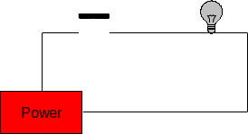
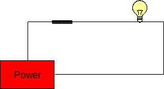

Becoming really good at computer science means having a good
understanding of all of the layers, what they do, and how they are used.
We will spend most of this lesson dealing with the hardware layer.  A
lot of devices have two states: a voltage is high or low, a switch is
open or closed, a light is on or off.  There are many ways of modeling
these two-state systems; some are very concrete and some are more
abstract. We’ll look at a number of these models, beginning with simple
models that are based on mechanical switches and light bulbs.

One of the most basic electrical connection is a light bulb that is
either connected to a power source (or not). A slightly more complicated
version of this includes a switch that can be either open or closed.
These switches are similar to the electrical switches in your home. We
will assume that these switches are connected to a source of power that
can supply current. The potential of a power source, such as a battery,
is called **voltage** and is measured in units called volts (V). Voltage
sources typically have a positive and negative end (called a terminal),
and the difference in the potential between both terminals is what we
use as the measurement of voltage. 

Voltage sources can produce either alternating current (AC) or direct current (DC). With DC, one terminal is always positive, and the other is always negative.  Examples of DC
sources are batteries such as the ones you would put in a small radio,
watch, or flashlight. With AC, the two terminals keep on swapping
positive and negative roles very quickly (60 times per second!).
Examples of AC sources are wall outlets that you would typically find in
your home.

## A Simple Circuit with a Switch

The simplest circuit that can be built contains a power supply, a single
switch, and a light bulb. If the switch is open, the light is off; if
the switch is closed, the light is on. The following figure illustrates 
both of these cases:

:::{layout-ncol=2}

:::

The state of these two circuits can be expressed in table form as follows:

|Switch|Light|
|------|-----|
|Open  | Off |
|Closed| On  |

: State table for single switch circuit

## Two Switches in Series

We can increase the complexity of this circuit somewhat by adding a second switch between the first
switch and the light bulb. This results in four possible configurations: 

1. both switches are open; 
2. the first switch is open and the second is closed; 
3. the first switch is closed and the second is open; and
4. both switches are closed. 

This is illustrated in the figure below.

These circuits are called **series circuits** since the two switches
occur on the same path from the power source back to itself. In series
circuits, when either one or both of the switches are open power will
not flow, and the light bulb will be off. Only when both switches are
closed does power flow, and the light bulb illuminates. Said another
way: if both switch A **and** switch B are closed, then the light will turn
on.

The relationship between the states of the two switches (open or closed)
and the state of the light bulb (on or off) is summarized in the
following table:

|Switch A|Switch B|Light|
|------|-----|-----|
|Open  |Open |Off |
|Open  |Closed|Off  |
|Closed|Open |Off |
|Closed|Closed|On  |

: State table for two switch in-sequence circuit

## Two Switches in Parellel

Another type of circuit can be designed using two switches. This second
type of circuit arranges the switches in parallel rather than in series.
In a two-switch **parallel circuit**, each of the switches is placed on
a separate path between the power source and the light bulb. The figure
below illustrates the four possible configurations of a two-switch
parallel circuit. As was the case with the series circuits, there are
four possible configurations of the circuit (in fact, they are exactly
the same as before). When both switches are open power does not flow and
the light bulb is off. However, whenever either or both of the switches
are closed, power flows and the light will turn on. Said another way, if
switch A **or** switch B is closed, then the light will turn on.

The relationship between the states of the two switches (open or closed)
and the state of the light bulb (on or off) is summarized in the
following table:

|Switch A|Switch B|Light|
|------|-----|-----|
|Open  |Open |Off |
|Open  |Closed|On  |
|Closed|Open |On  |
|Closed|Closed|On  |

: State table for two switch in-parallel circuit

More complex circuits with three or more switches are possible!

