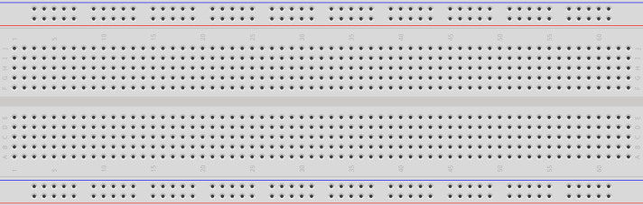
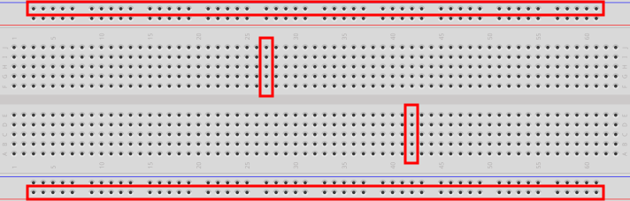
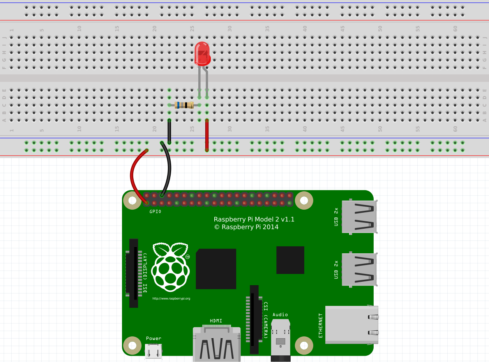
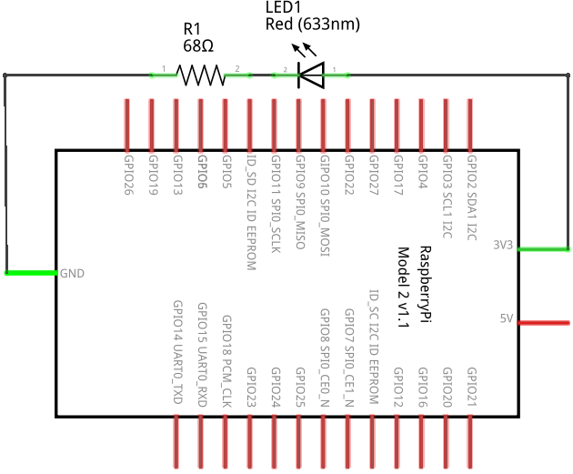
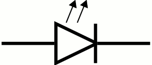
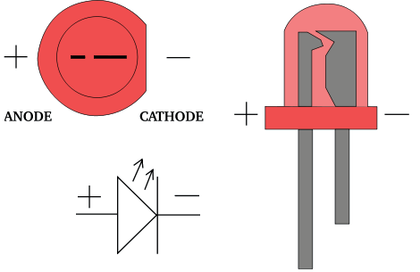
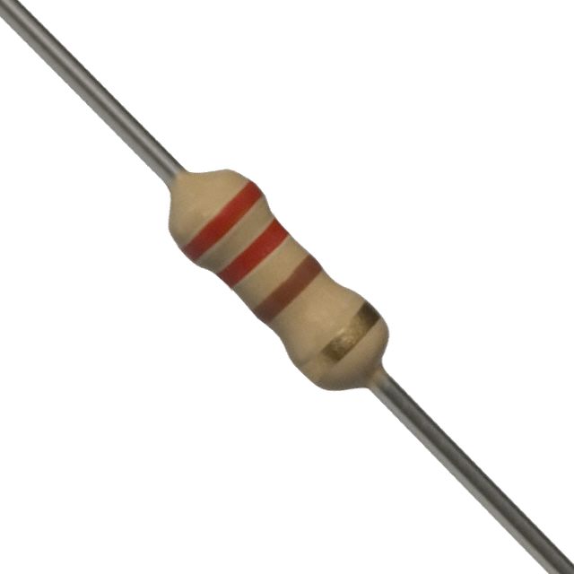

The next Raspberry Pi activity will involve implementing various
circuits that illustrate some of the ones covered above. Initially, the
Raspberry Pi will only be used as a power source. We will be connecting
it to a circuit prototyping board called a **breadboard**, and the
Raspberry Pi will provide power to the breadboard. A breadboard is used
to simplify the process of prototyping connections between electronic
components. It allows the making of secure connections between simple
electronic devices by simply plugging them into appropriate rows or
columns of the board. Here's an example of a breadboard:

::: {.callout-note title="Did you know" .column-margin}
Breadboards actually derive their name from a breadboard (i.e., a wooden
board on which bread is often cut). This is because early versions of
breadboards were made from the wooden bread cutting workstations.
:::

The holes in the breadboard allow electronic components (including
wires) to be connected to each other. Note that there are internal
connections within the breadboard. Each row along the top and bottom of
the breadboard is connected. In addition, each column in the center
portion is connected; however, there is a disconnect across the center
gap:

### Circuit Representation

The first part of the Raspberry Pi activity will simply be to connect a
power supply to a light. Since the Raspberry Pi provides DC, the light
we will use is called an LED. We'll explain this later; but for now,
here's an example of the connected electronic components for this part
of the activity:

The image above is an example of the topological layout of a circuit.
That is, it does a pretty good job of showing how the circuit looks
physically when connected. Of course, there are many more ways to layout
this exact circuit, and this is just one way. This method of diagramming
a circuit is called a **layout diagram** because it shows the physical
layout of the electronic (and other) components.

::: {.callout-tip title="Definition"}
A **circuit diagram** (also known as a **schematic**) is another way of
representing a circuit that only shows the connections and substitutes
actual electronic components with standard symbols.
:::

{#fig-circuitdiagram}

@fig-circuitdiagram is an example of a circuit diagram.

A circuit diagram is a useful way to represent a circuit. Note how it
can topologically be laid out in a number of ways. Various electronic
components have unique symbols. For example (in the circuit diagram
above), the LED has the following symbol:

{fig-align="center" width=30%}

The resistor has the following symbol:

{fig-align="center" width=40%}

The large rectangular object with lines coming out of it is the
Raspberry Pi. Technically, this represents the GPIO pins on the
Raspberry Pi. We'll discuss this more later. We will also show more
electronic components and their symbols later.

### The Components

Let's go through the components, one-by-one. At the bottom is the
Raspberry Pi. You will notice that there are two wires connecting some
pins on the RPi to the breadboard. We typically use red wires to signify
positive voltage and black wires to signify negative voltage. In DC, the
negative side is called ground. So red wires connect positive power to
something, and black wires connect something to ground.

The red “light” in the circuit is called an **LED** (Light Emitting
Diode). An LED is more convenient than a traditional light bulb, because
it does not require high voltage in order to turn it on. In fact, it
consumes such a small voltage that typical higher voltage levels would
render the LED unusable. Be careful when using LEDs, and never connect
them directly to a voltage source.

An LED allows current to flow through it in only one direction (from
positive to negative). LEDs have a short leg and a long leg. The short
leg is called the **cathode** and is the negative side. The long leg is
called the **anode** and is the positive side. The head of an LED is
also flat on one side: the negative (or cathode) side. LEDs come in
various colors (the one in the circuit above is red, for example). The
longer leg of an LED should **always** be connected to the positive side
of your voltage source. If it is connected backwards (i.e., with the
shorter leg connected to the positive side), the LED will not light and
may even burn out. For this reason, an LED should always be connected to
a DC voltage source.

{fig-align="center" width=70%}

Since most power sources are too strong for typical LEDs, we must reduce
the current somewhat so that the LED does not become damaged.
**Resistors** are typically used to resist the flow of electricity. When
using them with LEDs, we typically connect a resistor in series with the
LED. It doesn't matter if the resistor is on the positive or negative
side of the LED. It works the same in either case. Resistors come in
various resistances. Resistance is measured in a unit called the ohm
(Ω). Here is an example of a 220Ω resistor:

::: {.callout-note title="Did you know" .column-margin}
Resistors have different values, and the value of a resistor can be
determined by looking at the colored *bands* that surround its body.
Because resistors are typically small in size (any letters written on
one would be too small to be easily read), engineers invented a color
code that can be used to calculate the resistance of a resistor. There
are multiple online resources that can teach you how to read the value
of a resistor from its colors.
:::

{fig-align="center" width=30%}

### Ohm's Law

We can calculate the resistance required to resist the flow of
electricity through the LED using Ohm's Law. Ohm's Law establishes a
relationship between voltage, current, and resistance. Let's first fully
define each of these:

- **Voltage** is the difference in electric potential energy between two
  points. It can be considered as electric pressure and/or the work
  required to move electric charge between two points. The unit used to
  represent voltage is the **volt** (V).

- **Current** is the flow of electric charge (or electrons moving
  through a wire). The unit used to represent current is the **ampere**
  (A), or **amps**. We typically used the symbol I to represent current
  in a mathematical formula (such as Ohm's Law).

- **Resistance** is the measure of difficulty to pass an electric
  current through a conductor. A conductor is some material that allows
  the flow of electric current. The unit used to represent resistance is
  the ohm (Ω). We typically used the symbol R to represent resistance in
  a mathematical formula (such as Ohm's Law).

Ohm's Law is defined as the following:
$$
V = IR
$$

Stated formally, the voltage (electric potential difference) across two
points on a circuit is equivalent to the product of the current between
those two points and the total resistance of all electrical devices
present between those two points.

Consider the LED circuit above, where the red LED requires a forward
voltage of 2V (i.e., the amount of voltage required across the LED to
light it) and has a forward current of 20mA (i.e., the amount of current
flow required through the LED to sufficiently power it on). These values
are provided in the data sheet of the LED. A **data sheet** is a
document that provides technical information about an electrical
component.

We can calculate the resistance required in the circuit to ensure that
the LED lights up properly and is not possibly damaged by having too
much current move through it or too much voltage across it.  Suppose
that our power source (the Raspberry Pi) provides 3.3V. The voltage
difference across the source voltage and ground is 3.3V (since ground is
at 0V). According to the data sheet, the LED requires 2V across its legs
and requires 20mA of current through it. Using Ohm's Law we can solve
for R. The value for V is 1.3V (3.3V at the source – 2V through the
LED), and the value for I is 0.02A (20mA required through the LED).
And now we solve:
$$
\begin{split}
V &= I * R \\
(3.3V - 2V) &= 0.02A * R \\
1.3V &= 0.02A * R \\
65 &= R
\end{split}
$$

So the resistance should be 65Ω. The closest valued resistor available
is 68Ω. We can therefore use a 68Ω resistor in series with the LED. This
should be sufficient to turn it on brightly without damaging it.

You may have noticed that resistors also have a *wattage* rating. To
explain this, we must first discuss electric power. Electric power is
the rate at which electric energy is transferred by a circuit. The unit
used to represent power is the **watt** (W). Each component in a circuit
dissipates power (as heat – usually through friction – as electrons move
through the component). Therefore, each component has a power rating
that provides a measure of how much power it can dissipate without
breaking down. We can calculate the power dissipated in a circuit using
a variant of Ohm's Law:

$$
P=VI
$$

The power in a circuit is defined as the product of the voltage across
two points on a circuit and the current between those two points. In the
LED example above, the total power dissipated in the circuit is
calculated as follows:

$$
\begin{split}
P &= V * I\\
P &= 3.3V * 0.02 A\\
P &= 0.066W
\end{split}
$$

To calculate the power dissipated by each component, we simply need to
isolate the voltage drop across each. The current is constant in the
entire circuit. So for the LED, we can calculate the power dissipated as
follows:

$$
\begin{split}
P &= V * I\\
P &= 2V * 0.02 A\\
P &= 0.04 W
\end{split}
$$

So we would need an LED rated at 0.04W. And for the resistor:

$$
\begin{split}
P &= V * I\\
P &= ( 3.3V −2V ) * 0.02 A\\
P &= 1.3V * 0.02 A\\
P &= 0.026W
\end{split}
$$

So we would need a resistor rated at 0.026W.

In the end, we usually opt for a power rating that is greater than the
actual power dissipated by the component (so that it can last a long
time). A good target is not to exceed 60% of the wattage rating of the
component. For the resistor, this means a power rating of 0.043W ($0.026W
/ 0.6$). Most typical resistors are rated at 0.25W (some are 0.125W and
others are much higher). For the LED, this means a power rating of
0.067W ($0.04W / 0.6$), or 67mW. Most typical LEDs are rated at
approximately 120mW. For this circuit, a typical LED rated at 120mW and
a resistor rated at 1/8W would work just fine.

