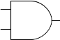
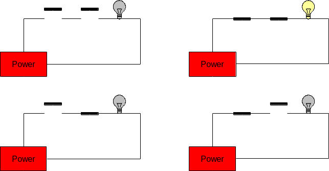
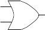
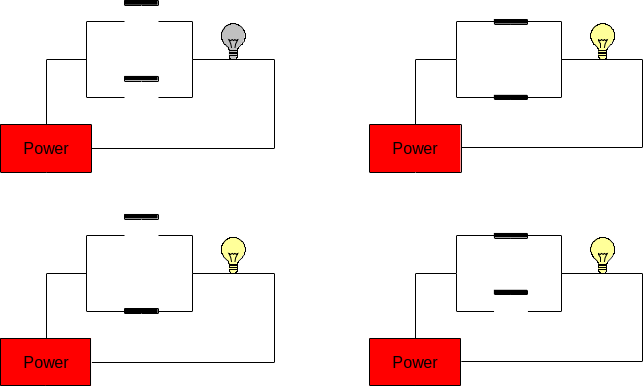
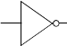

Gates are electronic versions of the mechanical switches introduced
earlier. Some gates have multiple inputs, but all gates have a single
output. Just as the switches and light bulbs of the previous examples
were always in either of two states, the inputs and outputs of gates are
confined to two voltage states.  The voltage of every input to the gate,
as well as the output from the gate, must be either high (positive
voltage) or low (0V, or ground). We use the symbol “1” to represent the
high voltage state and “0” to represent the low voltage state.

There are three basic kinds of logic gates: `and` gates, `or` gates, and `not`
gates. An **and** gate has two inputs and one output. The output is “1”
(high) only when both inputs are “1” (high). In all other cases the
output of and is “0” (low). Here is the symbol for an *and* gate (where
the two inputs are on the left, and the output is on the right):

{fig-align="center"}

We can represent the possible states of a gate in a truth table.

::: {.callout-tip title="Definition"}
A **truth table** defines the meaning of a gate, or circuit, by listing
every possible configuration of inputs along with the corresponding
output.
:::

Traditionally, inputs are listed on the left side of the table with the
output on the right. Each row of the truth table represents one
configuration that the circuit can be in. Truth tables for circuits with
n inputs will always have exactly 2^n^ rows, one for each possible
configuration of the inputs. The following is the truth table for the
and gate, where the inputs have been labeled A and B, and the output has
been labeled Z:

|A|B|Z|
|-|-|-|
|0|0|0|
|0|1|0|
|1|0|0|
|1|1|1|

: Truth table for basic AND gate {.striped .hover}

Since the and gate has two inputs, its truth table will contain 2^2^ = 4
rows. The first row of the truth table represents the situation in which
both inputs to the *and* gate are low. In this case the output will be low
as well. The second and third rows cover the cases in which one of the
inputs is high and the other is low. In line two, the first input is low
and the second is high; whereas in line three, the first input is high
and the second is low. In either case, the output is low. The final row
of the table represents the situation in which both inputs are high. In
this case, the output will be high as well.

The functionality of the *and* gate can be implemented by the series
circuit introduced earlier:

{fig-align="center"}

If the switches represent the inputs, A and B, then this circuit
correctly produces the output, Z, of an *and* gate (which is the light
bulb in the circuit). In fact, compare the truth table for the and gate
above with the truth table for the circuit:

::: {#tbl-andgate layout-ncol=2}
|Switch A|Switch B|Light|
|------|------|------|
| Open | Open | Off  |
| Open | Closed| Off  |
| Closed | Open | Off  |
| Closed | Closed | On|

: State table for Two Switches in Series {.striped .hover}

|A|B|Z|
|-|-|-|
|0|0|0|
|0|1|0|
|1|0|0|
|1|1|1|

: Truth table for basic AND gate {.striped .hover}

AND gate vs 2 switches in series
:::

If *Open* is replaced with 0 and *Closed* with 1, the tables are the
same. The reason that truth tables are called as such is that if 1 is
taken to mean *true* and 0 is taken to mean *false*, then the output of
the table defines the circumstances under which the specified logical
operation is true. For example, in common English usage, A *and* B will
be true only when both A and B are true. The statement: “My cat is old
and fat” is only true when the cat in question is both “old” and “fat.”
If my pet cat were either young, or skinny, or both, then the statement
would be false.

The thing that is so exceedingly cool about logic gates, and the
circuits that implement them, is that very simple devices can capture
small parts of what humans consider logical reasoning. As you can well
imagine, this idea caused great excitement when first discovered.

The **or** gate is similar to an *and* gate, in that it has two inputs
and one output. The output of the *or* gate is 1 whenever either (or
both) of the inputs are 1. The only case in which the output is 0 is
when both of the inputs are 0. Here is the symbol and truth table for
the *or* gate:

{fig-align="center"}

|A|B|Z|
|-|-|-|
|0|0|0|
|0|1|1|
|1|0|1|
|1|1|1|

: Truth table for basic OR gate {.striped .hover}

Again, the two inputs of the *or* gate are labeled A and B, and its output
is labeled Z. Notice that the *or* gate can be implemented by the parallel
circuit introduced earlier:

{fig-align="center"}

::: {#tbl-orgate layout-ncol=2}
|Switch A|Switch B|Light|
|------|------|------|
| Open | Open | Off  |
| Open | Closed| On  |
| Closed | Open | On  |
| Closed | Closed | On|

: State table for Two Switches in Parallel {.striped .hover}

|A|B|Z|
|-|-|-|
|0|0|0|
|0|1|1|
|1|0|1|
|1|1|1|

: Truth table for basic OR gate {.striped .hover}

OR gate vs 2 switches in parallel
:::

You should convince yourself that the behavior of the *or* gate captures
the semantics of the word “or” as it is commonly used. The statement:
“My cat is either on the couch or under the bed” is true if either the
phrase “My cat is on the couch” is true or the phrase “my cat is under
the bed” is true. The original statement is false only when neither of
these phrases is true.

The third basic logic gate is the **not** gate. The not gate has a single
input and a single output. The output is the inverse of the input. Here
is the symbol and truth table for the *not* gate:

{fig-align="center"}

|A|Z|
|-|-|
|0|1|
|1|0|

: A NOT gate's Truth table {.striped .hover}

Note that this truth table consists of only two rows rather than four
(as was the case with the and and or gates). This is consistent with the
claim that truth tables contain exactly 2^n^ rows for an *n* input
circuit.  Since the not gate takes in only a single input, there are
only two possible configurations that the gate can be in.

As with the *and* and *or* gates, the behavior of the not gate captures
the semantics of the word. If the sentence: “My cat is black” is true,
then the sentence “My cat is not black” would be false (and vice versa).

