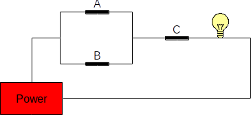
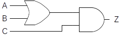
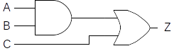

Consider the following circuit:

{fig-align="center"}

Here's its state table:

|Switch A|Switch B|Switch C|Light|
|--------|--------|--------|-----|
|Open	 |Open	  |Open	   | Off |
|Open	 |Open	  |Closed  | Off |
|Open	 |Closed  |Open	   | Off |
|Open	 |Closed  |Closed  | On  |
|Closed	 |Open	  |Open	   | Off |
|Closed	 |Open	  |Closed  | On  |
|Closed	 |Closed  |Open	   | Off |
|Closed	 |Closed  |Closed  | On  |

: {.striped .hover}

So long as either A **or** B is closed **and** C is closed, then the light bulb
is lit. C must be closed in order for the bulb to be lit.

It is natural to ask at this point what an equivalent circuit consisting
of logic gates would look like.  Since switches A and B are in parallel,
this portion of the circuit can be represented using an *or* gate.  The
output of that part of the circuit is in series with C, so it can be
modeled with an *and* gate. The logic gate circuit shown below is thus
equivalent to the switch circuit given above.

{fig-align="center"}

In fact, here is the truth table for this circuit:

|A|B|C|Z|
|-|-|-|-|
|0|0|0|0|
|0|0|1|0|
|0|1|0|0|
|0|1|1|1|
|1|0|0|0|
|1|0|1|1|
|1|1|0|0|
|1|1|1|1|

: {.striped .hover}

For readability and to make it a bit easier to derive, we can expand the
truth table to provide intermediate gate outputs as follows (where *Z* is
the output of *A or B*, and *Z'* is the output of *Z and C*):

|A|B|Z|C|Z'|
|-|-|-|-|-|
|0|0|0|0|0|
|0|0|0|1|0|
|0|1|1|0|0|
|0|1|1|1|1|
|1|0|1|0|0|
|1|0|1|1|1|
|1|1|1|0|0|
|1|1|1|1|1|

: {.striped .hover}

::: {.callout-important title="Activity" collapse=true}

Can you fill in the truth table for the circuit below? Let *Z* represent
the output of *A and B*, and *Z'* represent the output of *Z or C*.

{fig-align="center"}

:::

