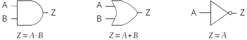
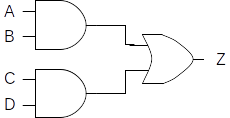

The arithmetic that is used to reason about two-state systems was first
developed by George Boole in 1854.

::: {.callout-tip title="Definition"}
**Boolean algebra** is a mathematics based on three fundamental operators:
and, or, and not; and the variables on which they operate.
:::

Boolean variables are binary, having only two valid states: 1
(representing *true*) and 0 (representing *false*).

The operator *and* is written as a dot “ ⋅ ”, *or* is written as a plus
“+”, and *not* is written as a horizontal bar drawn over the expression
being negated. The behavior of these three Boolean operators is
identical to the behavior of the corresponding logic gates. Thus, the
expression $A⋅B$ , meaning *A and B*, will be 1 (true) when the
variables *A* and *B* are both 1 (true). The expression $A + B$ ,
meaning *A or B*, will be 1 when either or both variables are 1. The
expression *not A* (written $\bar A$ ), will be 0 when *A* is 1 and 1
when *A* is 0. The relationship between the Boolean operators and the
fundamental logic gates is illustrated below. In the illustration, the
Boolean variables *A* and *B* correspond to the inputs to the circuit,
and the variable *Z* corresponds to the output.

{fig-align="center"}

As in ordinary algebra, Boolean algebra uses parentheses to indicate
which operands go with which operators. The Boolean expression $A+(B⋅C)$
represents a completely different circuit from $(A+B)⋅C$ .  In the
first, B and C are fed into an and gate, with the result being sent
(along with A) into an or gate. In the second, A and B are fed into an
or gate, with the result being combined with C via an and gate.

As you may be beginning to suspect, there is a direct correspondence
between Boolean expressions and logic circuits. Every logic circuit that
can ever be constructed will have a corresponding Boolean expression,
and every valid Boolean expression that can ever be written maps to an
equivalent logic circuit. The process of converting between the two
representations is quite mechanical: simply use the substitutions above,
being sure to parenthesize Boolean expressions in a manner that
preserves which operators go with which operands.

::: {.callout-important title="Activity" collapse=true}
Try to write the Boolean expression corresponding to the following
circuit:

{fig-align="center"}
:::

Boolean algebra provides computer scientists and engineers a powerful
tool for concisely representing circuits and reasoning about their
behavior. While the details are beyond the scope of this lesson, Boolean
algebra allows us to do things like prove that two different circuits
compute the same function; or find simpler (and thus less expensive)
ways of implementing the functionality of a circuit.

