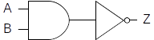
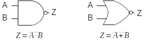
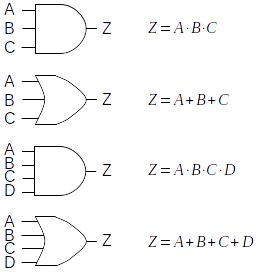
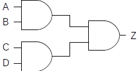

Any device, whose operation can be defined in terms of a truth table or
Boolean expression, can be implemented using only the fundamental logic
gates: *and*, *or*, and *not*. However, a number of additional gates are
usually defined, as they prove useful for practical purposes. For
example, it is frequently the case that a not will immediately follow an
*and* gate, like so:

{fig-align="center"}

Since this is such a common occurrence, the circuit has been given a
name (*nand*) and a gate symbol (the *and* symbol combined with the
bubble from the *not* symbol).  Similarly, *not* often follows *or*, so
there is a *nor* gate whose symbol is the bubble from the *not* attached
to the *or* symbol. The following figure illustrates both the *nand* and
*nor* gates. Their behavior, in terms of Boolean expressions, is
provided as well. It is important to remember that these gates are
simply a convenience (a kind of shorthand), in that they allow a circuit
to be constructed from fewer underlying components.

{fig-align="center"}

As another example, the basic *and* and *or* gates support only two inputs;
however, a circuit designer will frequently need to *and* or *or* more than
two inputs. For this reason multi-input and and or gates exist.

The following figure presents the three and four input *and* and *or*
gates along with their Boolean expressions:

{fig-align="center"}

While these gates are often quite convenient, remember that it is always
possible to construct equivalent circuits from the underlying two-input
gates. For example, the following circuit represents one possible
implementation of a four-input *and* gate:

{fig-align="center"}

Its Boolean expression is $Z =(A⋅B)⋅(C⋅D)$ . Note, however, that it
could be designed differently (with a different Boolean expression), yet
still represent a four-input and gate. For example, $Z =((A⋅B)⋅C)⋅D$
would also work. The other multi-input gates can be constructed in a
similar manner.

In addition to multi-input *and* and *or* gates, multi-input *nand* and
*nor* gates can be constructed. The symbols for these gates are
identical to the symbols for the multi-input *and* and *or* gates, with
the exception of a *not* bubble attached to the output of each gate
symbol. Their Boolean expressions are also identical as well, except
that a *not* bar appears above the right-hand side of the expression.

