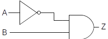
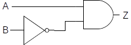
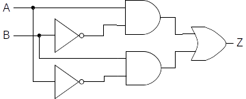

::: {.callout-tip title="Definition"}
**Combinational circuits** are digital circuits that do not involve any kind
of feedback. In other words, the output of a combinational circuit
cannot be fed back into that circuit as input.
:::

In this lesson, we will focus on the simplest combinational circuits.
Let's start with a relatively simple circuit, the *exclusive or*.

An exclusive or, or *xor*, has two inputs and a single output. Its
behavior is defined by the following truth table, where the inputs are
labeled *A* and *B* and the output is labeled *Z*:

|A|B|Z|
|-|-|-|
|0|0|0|
|0|1|1|
|1|0|1|
|1|1|0|

: Truth table for XOR gate {.striped .hover}

Like the standard two-input or, the *xor* produces a 1 (true) when
either of its inputs are 1, and a 0 (false) when both of its inputs are
0. The difference between *or* and *xor* appears in the case when both
inputs are 1. The standard *or* produces a 1 in this case. The *xor*
generates a 0. In other words, the “exclusive or” outputs a 1 when
either, *but not both*, of its inputs are 1.

English does not contain a unique word for expressing the idea of *xor*
– the word “or” does double duty for both its “inclusive” and
“exclusive” forms. However, one can usually tell from the context of a
sentence which form is intended. For example, if you tell a child “you
can have candy or popcorn,” the intended meaning is exclusive or –
either candy or popcorn, but not both. On the other hand, if a friend
says “I’d be happy winning either the Porsche or the Mercedes,” the
intended meaning is inclusive or – you would certainly not expect your
friend to become unhappy if he won both cars.

Now that we understand the behavior of *xor* in terms of its inputs and
outputs, we can turn our attention to the problem of designing a circuit
with its behavior. But how are we to begin?

One approach that often gets you moving in the right direction is to
examine the truth table to determine the various circumstances under
which the circuit must produce a 1. In the case of xor, there are two
such cases: one in which input A is 0 and input B is 1, and another in
which input A is 1 and input B is 0.  Once these cases have been
identified, we proceed by designing *sub-circuits* that will produce 1
in each of the required cases. The final step is to combine the
sub-circuits together using an *or* gate. This is necessary because the
main circuit would be true under any of the cases in which the
sub-circuits generate a 1.

The following sub-circuit will generate a 1 when input A is 0 and input
B is 1. Its Boolean expression is $Z=\bar A⋅B$:

{fig-align="center"}

It works by negating A and feeding that result (together with B) into an
*and* gate. Since both of the inputs to an *and* must be 1 for it to
produce a 1, the original value of A must be 0, while the value of B
must be 1. Under all other circumstances this sub-circuit produces 0.
Thus, this circuit successfully captures the meaning of line two of the
*xor* truth table.

A sub-circuit to implement line three of the xor truth table can be
constructed similarly. Its Boolean expression is $Z =A⋅\bar B$ :

{fig-align="center"}

This circuit generates a 1 whenever input A is 1 and B is 0. Under all
other circumstances, it produces a 0. The following figure illustrates a
complete *xor* circuit, which contains the two sub-circuits joined
together by an *or* gate. This is reasonable since the *xor* can be true
either by way of the first sub-circuit or the second. Note that due to
the manner in which the two sub-circuits were constructed, it is
impossible for both of them to be true at the same time.

{fig-align="center"}

The Boolean expression for this circuit is $Z =(A⋅\bar B)+(\bar A⋅B)$ .

