Computer architecture is a wide branch of computer science that seeks to
find answers to questions such as, “What makes up a computer?” and, “How
is it that we can use a computer?” The answers to these questions are
continuously changing, but we will attempt to give a simple answer in
this lesson.

In a previous lesson, we discussed how computer hardware works. Recall
that all general-purpose computers, at a minimum, consist of the
following hardware components: a central processing unit (CPU), main
memory, secondary storage, various input/output (I/O) devices, and a
data bus. The **data bus** is like a highway that the other components use
to communicate with each other. **Main memory** is used to store data and
programs that are currently being used. **I/O devices** allow the outside
world to communicate with the computer. The **CPU** is the device that is
responsible for actually executing the instructions that make up a
program.

Let's further discuss the brains of the computer, the CPU. The operation
of the CPU is governed by the instruction cycle.

::: {.callout-tip title="Definition"}
The **instruction cycle** is a procedure that consists of three phases:
instruction fetch, instruction decode, and instruction execution.
:::

The CPU’s task is to perform the instruction cycle over and over until
explicitly instructed to halt. The **fetch phase** of the instruction cycle
consists of retrieving an instruction from memory. The **decode** phase
concerns determining what actions the instruction is requesting the CPU
to perform. Instruction **execution** involves performing the operation
requested by the instruction.

## The layers of a computer system

To fully understand computer architecture, it is important to understand
the idea of abstraction as it is used in the field of computer science.
Abstraction is an idea of dealing with complex and interconnected
systems whereby a user is only interested in the operations of a certain
level of complexity and suppresses more complex details. Abstraction is
analogous to looking at Google map of a large country, such as the USA.
We can see the individual states, large lakes, surrounding oceans, and
neighboring countries. At this level of abstraction, one is unable to
see the finer details within a state (such as the names of cities,
towns, and major roads). However, zooming in provides an increased level
of detail.  The entire country is no longer visible; instead, perhaps
only a single state (e.g., Louisiana) and its neighbors are visible. At
this *zoomed in* level, we can now see some of the cities and major roads.
However, we cannot see some of the details of the *zoomed out* level such
as the states that are not immediate neighbors or the oceans. If we *zoom
in* to an even lower level, we can see street names, major buildings, and
so on. Again, we lose some of the details at the higher levels. Dividing
a complex system (like a map) into levels that progressively abstract
away detail allows users of the system to only deal with information
that is relevant at a given time.

{#fig-complayers}

A computer is a very complex system consisting of multiple layers (see
@fig-complayers). At the very top is the **user**. Users interact with
computers in a variety of ways. That is, they can (and do) interact
directly with applications (like a spreadsheet application, a game, or a
Web browser). Users can also interact directly with the operating system
(e.g., through its GUI or via the console) and with system utilities
(think of applications that are provided by the operating system). The
**application layer** is the next layer, immediately below the user. It
is the layer that a computer user typically interacts with. For example,
a user can type and send an email without needing to know how the
characters on the screen are made to appear on another computer perhaps
one thousand miles away. A user might double-click an audio file on the
desktop without needing to know how the computer understands what a
double-click is or how to “play” the audio file.

The next layer is the **operating system** layer. This layer understands
user inputs (like typing or double- clicks) and figures out ways of
interpreting and executing those inputs. There are many examples of
operating systems (e.g., Linux, Windows, MacOS, Unix, Solaris). Of
these, Window is still the most common. What is the operating system on
your Raspberry Pi? At its core, the operating system is what allows
users to interact with the computer and actually make use of it.

**System utilities** are like applications, but provided directly by the
operating system. In one sense, they provide an interface to certain
parts of the operating system that allow users to do frequently needed
things. For example, the system utility of copying or moving files is
often used. Users don't have to install an application that permits
copying and moving files around. This is a system utility provided by
the operating system. Since system utilities are essentially embedded in
the operating system, this layer sits at the same level as the operating
system layer.

The layer beneath the operating system layer is the **hardware
abstraction** layer (or HAL). Sometimes, this layer is referred to as
the device driver layer. There are many different types and designs of
computers, and this layer makes sure that the computer hardware acts the
same regardless of the computer's design. For example, it makes sure
that the “on” button switches on the computer regardless of where it is
located. It makes sure that hitting a specific button opens the CD
drive. It provides the operating system with clear instructions on how
it can interact with the physical hardware of the computer.

The bottom layer is the **hardware layer**. It represents the physical,
tangible stuff that you can see or touch (e.g., keyboard, monitor,
mouse, case, power supply, motherboard, etc).

## Fundamentals of digital logic

Becoming really good at computer science means having a good
understanding of all of the layers, what they do, and how they are used.
We will spend most of this lesson dealing with the hardware layer.  A
lot of devices have two states: a voltage is high or low, a switch is
open or closed, a light is on or off.  There are many ways of modeling
these two-state systems; some are very concrete and some are more
abstract. We’ll look at a number of these models, beginning with simple
models that are based on mechanical switches and light bulbs.

One of the most basic electrical connection is a light bulb that is
either connected to a power source (or not). A slightly more complicated
version of this includes a switch that can be either open or closed.
These switches are similar to the electrical switches in your home. We
will assume that these switches are connected to a source of power that
can supply current. The potential of a power source, such as a battery,
is called voltage and is measured in units called volts (V). Voltage
sources typically have a positive and negative end (called a terminal),
and the difference in the potential between both terminals is what we
use as the measurement of voltage. Voltage sources can produce either
alternating current (AC) or direct current (DC). With DC, one terminal
is always positive, and the other is always negative.  Examples of DC
sources are batteries such as the ones you would put in a small radio,
watch, or flashlight. With AC, the two terminals keep on swapping
positive and negative roles very quickly (60 times per second!).
Examples of AC sources are wall outlets that you would typically find in
your home.

The simplest circuit that can be built contains a power supply, a single
switch, and a light bulb. If the switch is open, the light is off; if
the switch is closed, the light is on. The following figure illustrates 
both of these cases:

:::{layout-ncol=2}

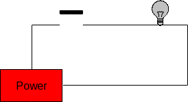

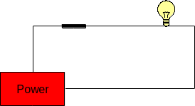

:::

The state of these two circuits can be expressed in table form as follows:

|Switch|Light|
|------|-----|
|Open  | Off |
|Closed| On  |

: State table for single switch circuit

We can increase the complexity of this circuit somewhat by adding a second switch between the first
switch and the light bulb. This results in four possible configurations: 

1. both switches are open; 
2. the first switch is open and the second is closed; 
3. the first switch is closed and the second is open; and
4. both switches are closed. 

This is illustrated in the figure below.

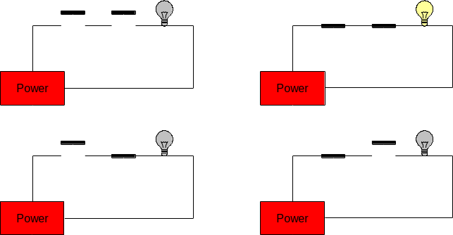

These circuits are called **series circuits** since the two switches
occur on the same path from the power source back to itself. In series
circuits, when either one or both of the switches are open power will
not flow, and the light bulb will be off. Only when both switches are
closed does power flow, and the light bulb illuminates. Said another
way: if both switch A **and** switch B are closed, then the light will turn
on.

The relationship between the states of the two switches (open or closed)
and the state of the light bulb (on or off) is summarized in the
following table:

|Switch A|Switch B|Light|
|------|-----|-----|
|Open  |Open |Off |
|Open  |Closed|Off  |
|Closed|Open |Off |
|Closed|Closed|On  |

: State table for two switch in-sequence circuit

Another type of circuit can be designed using two switches. This second
type of circuit arranges the switches in parallel rather than in series.
In a two-switch **parallel circuit**, each of the switches is placed on
a separate path between the power source and the light bulb. The figure
below illustrates the four possible configurations of a two-switch
parallel circuit. As was the case with the series circuits, there are
four possible configurations of the circuit (in fact, they are exactly
the same as before). When both switches are open power does not flow and
the light bulb is off. However, whenever either or both of the switches
are closed, power flows and the light will turn on. Said another way, if
switch A **or** switch B is closed, then the light will turn on.

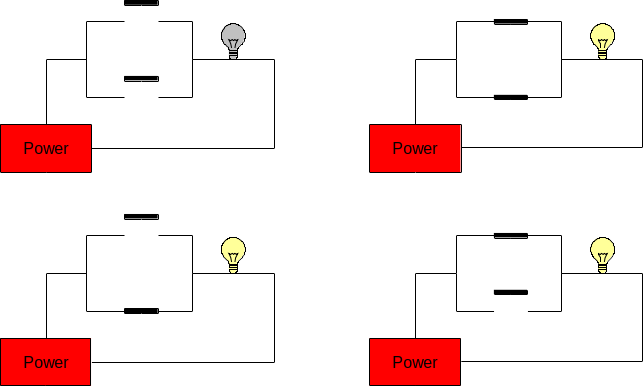

The relationship between the states of the two switches (open or closed)
and the state of the light bulb (on or off) is summarized in the
following table:

|Switch A|Switch B|Light|
|------|-----|-----|
|Open  |Open |Off |
|Open  |Closed|On  |
|Closed|Open |On  |
|Closed|Closed|On  |

: State table for two switch in-parallel circuit

More complex circuits with three or more switches are possible!

## LED the Way (Preview)

The next Raspberry Pi activity will involve implementing various
circuits that illustrate some of the ones covered above. Initially, the
Raspberry Pi will only be used as a power source. We will be connecting
it to a circuit prototyping board called a **breadboard**, and the
Raspberry Pi will provide power to the breadboard. A breadboard is used
to simplify the process of prototyping connections between electronic
components. It allows the making of secure connections between simple
electronic devices by simply plugging them into appropriate rows or
columns of the board. Here's an example of a breadboard:

::: {.callout-note title="Did you know" .column-margin}
Breadboards actually derive their name from a breadboard (i.e., a wooden
board on which bread is often cut). This is because early versions of
breadboards were made from the wooden bread cutting workstations.
:::

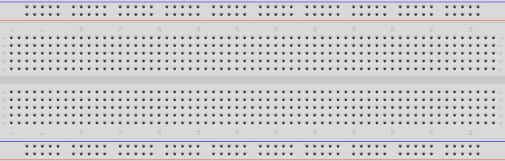

The holes in the breadboard allow electronic components (including
wires) to be connected to each other. Note that there are internal
connections within the breadboard. Each row along the top and bottom of
the breadboard is connected. In addition, each column in the center
portion is connected; however, there is a disconnect across the center
gap:

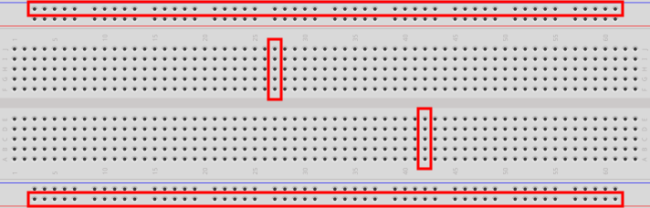

### Circuit Representation

The first part of the Raspberry Pi activity will simply be to connect a
power supply to a light. Since the Raspberry Pi provides DC, the light
we will use is called an LED. We'll explain this later; but for now,
here's an example of the connected electronic components for this part
of the activity:

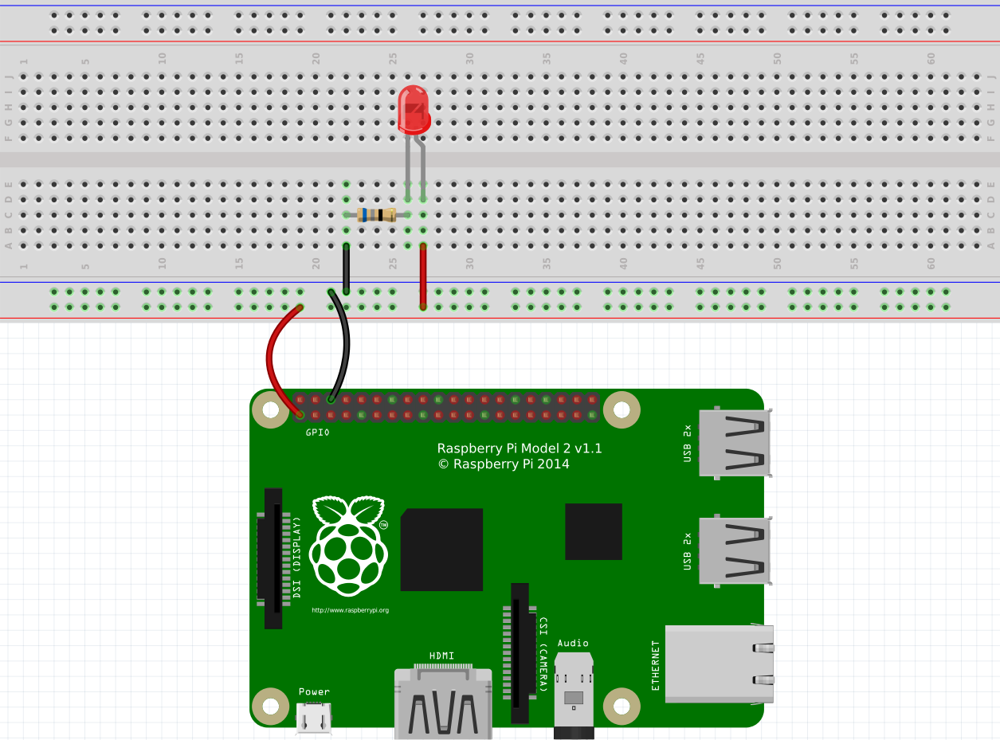

The image above is an example of the topological layout of a circuit.
That is, it does a pretty good job of showing how the circuit looks
physically when connected. Of course, there are many more ways to layout
this exact circuit, and this is just one way. This method of diagramming
a circuit is called a **layout diagram** because it shows the physical
layout of the electronic (and other) components.

::: {.callout-tip title="Definition"}
A **circuit diagram** (also known as a **schematic**) is another way of
representing a circuit that only shows the connections and substitutes
actual electronic components with standard symbols.
:::

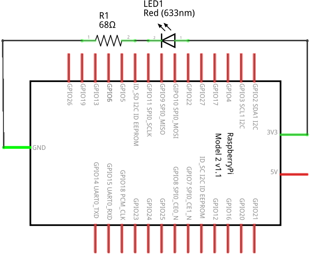{#fig-circuitdiagram}

@fig-circuitdiagram is an example of a circuit diagram.

A circuit diagram is a useful way to represent a circuit. Note how it
can topologically be laid out in a number of ways. Various electronic
components have unique symbols. For example (in the circuit diagram
above), the LED has the following symbol:

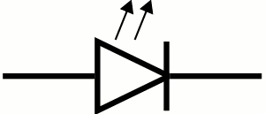{fig-align="center" width=30%}

The resistor has the following symbol:

{fig-align="center" width=40%}

The large rectangular object with lines coming out of it is the
Raspberry Pi. Technically, this represents the GPIO pins on the
Raspberry Pi. We'll discuss this more later. We will also show more
electronic components and their symbols later.

### The Components

Let's go through the components, one-by-one. At the bottom is the
Raspberry Pi. You will notice that there are two wires connecting some
pins on the RPi to the breadboard. We typically use red wires to signify
positive voltage and black wires to signify negative voltage. In DC, the
negative side is called ground. So red wires connect positive power to
something, and black wires connect something to ground.

The red “light” in the circuit is called an **LED** (Light Emitting
Diode). An LED is more convenient than a traditional light bulb, because
it does not require high voltage in order to turn it on. In fact, it
consumes such a small voltage that typical higher voltage levels would
render the LED unusable. Be careful when using LEDs, and never connect
them directly to a voltage source.

An LED allows current to flow through it in only one direction (from
positive to negative). LEDs have a short leg and a long leg. The short
leg is called the **cathode** and is the negative side. The long leg is
called the **anode** and is the positive side. The head of an LED is
also flat on one side: the negative (or cathode) side. LEDs come in
various colors (the one in the circuit above is red, for example). The
longer leg of an LED should **always** be connected to the positive side
of your voltage source. If it is connected backwards (i.e., with the
shorter leg connected to the positive side), the LED will not light and
may even burn out. For this reason, an LED should always be connected to
a DC voltage source.

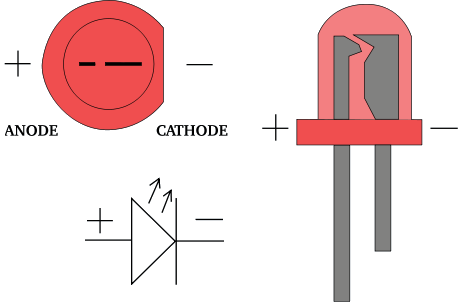{fig-align="center" width=70%}

Since most power sources are too strong for typical LEDs, we must reduce
the current somewhat so that the LED does not become damaged.
**Resistors** are typically used to resist the flow of electricity. When
using them with LEDs, we typically connect a resistor in series with the
LED. It doesn't matter if the resistor is on the positive or negative
side of the LED. It works the same in either case. Resistors come in
various resistances. Resistance is measured in a unit called the ohm
(Ω). Here is an example of a 220Ω resistor:

::: {.callout-note title="Did you know" .column-margin}
Resistors have different values, and the value of a resistor can be
determined by looking at the colored *bands* that surround its body.
Because resistors are typically small in size (any letters written on
one would be too small to be easily read), engineers invented a color
code that can be used to calculate the resistance of a resistor. There
are multiple online resources that can teach you how to read the value
of a resistor from its colors.
:::

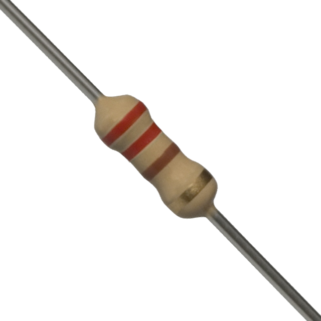{fig-align="center" width=30%}

### Ohm's Law

We can calculate the resistance required to resist the flow of
electricity through the LED using Ohm's Law. Ohm's Law establishes a
relationship between voltage, current, and resistance. Let's first fully
define each of these:

- **Voltage** is the difference in electric potential energy between two
  points. It can be considered as electric pressure and/or the work
  required to move electric charge between two points. The unit used to
  represent voltage is the **volt** (V).

- **Current** is the flow of electric charge (or electrons moving
  through a wire). The unit used to represent current is the **ampere**
  (A), or **amps**. We typically used the symbol I to represent current
  in a mathematical formula (such as Ohm's Law).

- **Resistance** is the measure of difficulty to pass an electric
  current through a conductor. A conductor is some material that allows
  the flow of electric current. The unit used to represent resistance is
  the ohm (Ω). We typically used the symbol R to represent resistance in
  a mathematical formula (such as Ohm's Law).

Ohm's Law is defined as the following:
$$
V = IR
$$

Stated formally, the voltage (electric potential difference) across two
points on a circuit is equivalent to the product of the current between
those two points and the total resistance of all electrical devices
present between those two points.

Consider the LED circuit above, where the red LED requires a forward
voltage of 2V (i.e., the amount of voltage required across the LED to
light it) and has a forward current of 20mA (i.e., the amount of current
flow required through the LED to sufficiently power it on). These values
are provided in the data sheet of the LED. A **data sheet** is a
document that provides technical information about an electrical
component.

We can calculate the resistance required in the circuit to ensure that
the LED lights up properly and is not possibly damaged by having too
much current move through it or too much voltage across it.  Suppose
that our power source (the Raspberry Pi) provides 3.3V. The voltage
difference across the source voltage and ground is 3.3V (since ground is
at 0V). According to the data sheet, the LED requires 2V across its legs
and requires 20mA of current through it. Using Ohm's Law we can solve
for R. The value for V is 1.3V (3.3V at the source – 2V through the
LED), and the value for I is 0.02A (20mA required through the LED).
And now we solve:
$$
\begin{split}
V &= I * R \\
(3.3V - 2V) &= 0.02A * R \\
1.3V &= 0.02A * R \\
65 &= R
\end{split}
$$

So the resistance should be 65Ω. The closest valued resistor available
is 68Ω. We can therefore use a 68Ω resistor in series with the LED. This
should be sufficient to turn it on brightly without damaging it.

You may have noticed that resistors also have a *wattage* rating. To
explain this, we must first discuss electric power. Electric power is
the rate at which electric energy is transferred by a circuit. The unit
used to represent power is the **watt** (W). Each component in a circuit
dissipates power (as heat – usually through friction – as electrons move
through the component). Therefore, each component has a power rating
that provides a measure of how much power it can dissipate without
breaking down. We can calculate the power dissipated in a circuit using
a variant of Ohm's Law:

$$
P=VI
$$

The power in a circuit is defined as the product of the voltage across
two points on a circuit and the current between those two points. In the
LED example above, the total power dissipated in the circuit is
calculated as follows:

$$
\begin{split}
P &= V * I\\
P &= 3.3V * 0.02 A\\
P &= 0.066W
\end{split}
$$

To calculate the power dissipated by each component, we simply need to
isolate the voltage drop across each. The current is constant in the
entire circuit. So for the LED, we can calculate the power dissipated as
follows:

$$
\begin{split}
P &= V * I\\
P &= 2V * 0.02 A\\
P &= 0.04 W
\end{split}
$$

So we would need an LED rated at 0.04W. And for the resistor:

$$
\begin{split}
P &= V * I\\
P &= ( 3.3V −2V ) * 0.02 A\\
P &= 1.3V * 0.02 A\\
P &= 0.026W
\end{split}
$$

So we would need a resistor rated at 0.026W.

In the end, we usually opt for a power rating that is greater than the
actual power dissipated by the component (so that it can last a long
time). A good target is not to exceed 60% of the wattage rating of the
component. For the resistor, this means a power rating of 0.043W ($0.026W
/ 0.6$). Most typical resistors are rated at 0.25W (some are 0.125W and
others are much higher). For the LED, this means a power rating of
0.067W ($0.04W / 0.6$), or 67mW. Most typical LEDs are rated at
approximately 120mW. For this circuit, a typical LED rated at 120mW and
a resistor rated at 1/8W would work just fine.

## Logic Gates

Gates are electronic versions of the mechanical switches introduced
earlier. Some gates have multiple inputs, but all gates have a single
output. Just as the switches and light bulbs of the previous examples
were always in either of two states, the inputs and outputs of gates are
confined to two voltage states.  The voltage of every input to the gate,
as well as the output from the gate, must be either high (positive
voltage) or low (0V, or ground). We use the symbol “1” to represent the
high voltage state and “0” to represent the low voltage state.

There are three basic kinds of logic gates: and gates, or gates, and not
gates. An **and** gate has two inputs and one output. The output is “1”
(high) only when both inputs are “1” (high). In all other cases the
output of and is “0” (low). Here is the symbol for an *and* gate (where
the two inputs are on the left, and the output is on the right):

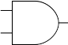{fig-align="center"}

We can represent the possible states of a gate in a truth table.

::: {.callout-tip title="Definition"}
A **truth table** defines the meaning of a gate, or circuit, by listing
every possible configuration of inputs along with the corresponding
output.
:::

Traditionally, inputs are listed on the left side of the table with the
output on the right. Each row of the truth table represents one
configuration that the circuit can be in. Truth tables for circuits with
n inputs will always have exactly 2^n^ rows, one for each possible
configuration of the inputs. The following is the truth table for the
and gate, where the inputs have been labeled A and B, and the output has
been labeled Z:

|A|B|Z|
|-|-|-|
|0|0|0|
|0|1|0|
|1|0|0|
|1|1|1|

: Truth table for basic AND gate {.striped .hover}

Since the and gate has two inputs, its truth table will contain 2^2^ = 4
rows. The first row of the truth table represents the situation in which
both inputs to the *and* gate are low. In this case the output will be low
as well. The second and third rows cover the cases in which one of the
inputs is high and the other is low. In line two, the first input is low
and the second is high; whereas in line three, the first input is high
and the second is low. In either case, the output is low. The final row
of the table represents the situation in which both inputs are high. In
this case, the output will be high as well.

The functionality of the *and* gate can be implemented by the series
circuit introduced earlier:

{fig-align="center"}

If the switches represent the inputs, A and B, then this circuit
correctly produces the output, Z, of an *and* gate (which is the light
bulb in the circuit). In fact, compare the truth table for the and gate
above with the truth table for the circuit:

::: {#tbl-andgate layout-ncol=2}
|Switch A|Switch B|Light|
|------|------|------|
| Open | Open | Off  |
| Open | Closed| Off  |
| Closed | Open | Off  |
| Closed | Closed | On|

: State table for Two Switches in Series {.striped .hover}

|A|B|Z|
|-|-|-|
|0|0|0|
|0|1|0|
|1|0|0|
|1|1|1|

: Truth table for basic AND gate {.striped .hover}

AND gate vs 2 switches in series
:::

If *Open* is replaced with 0 and *Closed* with 1, the tables are the
same. The reason that truth tables are called as such is that if 1 is
taken to mean *true* and 0 is taken to mean *false*, then the output of
the table defines the circumstances under which the specified logical
operation is true. For example, in common English usage, A *and* B will
be true only when both A and B are true. The statement: “My cat is old
and fat” is only true when the cat in question is both “old” and “fat.”
If my pet cat were either young, or skinny, or both, then the statement
would be false.

The thing that is so exceedingly cool about logic gates, and the
circuits that implement them, is that very simple devices can capture
small parts of what humans consider logical reasoning. As you can well
imagine, this idea caused great excitement when first discovered.

The **or** gate is similar to an *and* gate, in that it has two inputs
and one output. The output of the *or* gate is 1 whenever either (or
both) of the inputs are 1. The only case in which the output is 0 is
when both of the inputs are 0. Here is the symbol and truth table for
the *or* gate:

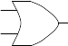{fig-align="center"}

|A|B|Z|
|-|-|-|
|0|0|0|
|0|1|1|
|1|0|1|
|1|1|1|

: Truth table for basic OR gate {.striped .hover}

Again, the two inputs of the *or* gate are labeled A and B, and its output
is labeled Z. Notice that the *or* gate can be implemented by the parallel
circuit introduced earlier:

{fig-align="center"}

::: {#tbl-orgate layout-ncol=2}
|Switch A|Switch B|Light|
|------|------|------|
| Open | Open | Off  |
| Open | Closed| On  |
| Closed | Open | On  |
| Closed | Closed | On|

: State table for Two Switches in Parallel {.striped .hover}

|A|B|Z|
|-|-|-|
|0|0|0|
|0|1|1|
|1|0|1|
|1|1|1|

: Truth table for basic OR gate {.striped .hover}

OR gate vs 2 switches in parallel
:::

You should convince yourself that the behavior of the *or* gate captures
the semantics of the word “or” as it is commonly used. The statement:
“My cat is either on the couch or under the bed” is true if either the
phrase “My cat is on the couch” is true or the phrase “my cat is under
the bed” is true. The original statement is false only when neither of
these phrases is true.

The third basic logic gate is the **not** gate. The not gate has a single
input and a single output. The output is the inverse of the input. Here
is the symbol and truth table for the *not* gate:

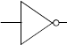{fig-align="center"}

|A|Z|
|-|-|
|0|1|
|1|0|

: A NOT gate's Truth table {.striped .hover}

Note that this truth table consists of only two rows rather than four
(as was the case with the and and or gates). This is consistent with the
claim that truth tables contain exactly 2^n^ rows for an *n* input
circuit.  Since the not gate takes in only a single input, there are
only two possible configurations that the gate can be in.

As with the *and* and *or* gates, the behavior of the not gate captures
the semantics of the word. If the sentence: “My cat is black” is true,
then the sentence “My cat is not black” would be false (and vice versa).

## Combining Gates

Consider the following circuit:

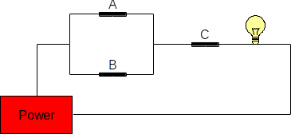{fig-align="center"}

Here's its state table:

|Switch A|Switch B|Switch C|Light|
|--------|--------|--------|-----|
|Open	 |Open	  |Open	   | Off |
|Open	 |Open	  |Closed  | Off |
|Open	 |Closed  |Open	   | Off |
|Open	 |Closed  |Closed  | On  |
|Closed	 |Open	  |Open	   | Off |
|Closed	 |Open	  |Closed  | On  |
|Closed	 |Closed  |Open	   | Off |
|Closed	 |Closed  |Closed  | On  |

: {.striped .hover}

So long as either A **or** B is closed **and** C is closed, then the light bulb
is lit. C must be closed in order for the bulb to be lit.

It is natural to ask at this point what an equivalent circuit consisting
of logic gates would look like.  Since switches A and B are in parallel,
this portion of the circuit can be represented using an *or* gate.  The
output of that part of the circuit is in series with C, so it can be
modeled with an *and* gate. The logic gate circuit shown below is thus
equivalent to the switch circuit given above.

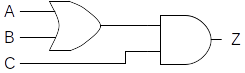{fig-align="center"}

In fact, here is the truth table for this circuit:

|A|B|C|Z|
|-|-|-|-|
|0|0|0|0|
|0|0|1|0|
|0|1|0|0|
|0|1|1|1|
|1|0|0|0|
|1|0|1|1|
|1|1|0|0|
|1|1|1|1|

: {.striped .hover}

For readability and to make it a bit easier to derive, we can expand the
truth table to provide intermediate gate outputs as follows (where *Z* is
the output of *A or B*, and *Z'* is the output of *Z and C*):

|A|B|Z|C|Z'|
|-|-|-|-|-|
|0|0|0|0|0|
|0|0|0|1|0|
|0|1|1|0|0|
|0|1|1|1|1|
|1|0|1|0|0|
|1|0|1|1|1|
|1|1|1|0|0|
|1|1|1|1|1|

: {.striped .hover}

::: {.callout-important title="Activity" collapse=true}

Can you fill in the truth table for the circuit below? Let *Z* represent
the output of *A and B*, and *Z'* represent the output of *Z or C*.

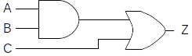{fig-align="center"}

:::

## Boolean Algebra

The arithmetic that is used to reason about two-state systems was first
developed by George Boole in 1854.

::: {.callout-tip title="Definition"}
**Boolean algebra** is a mathematics based on three fundamental operators:
and, or, and not; and the variables on which they operate.
:::

Boolean variables are binary, having only two valid states: 1
(representing *true*) and 0 (representing *false*).

The operator *and* is written as a dot “ ⋅ ”, *or* is written as a plus
“+”, and *not* is written as a horizontal bar drawn over the expression
being negated. The behavior of these three Boolean operators is
identical to the behavior of the corresponding logic gates. Thus, the
expression $A⋅B$ , meaning *A and B*, will be 1 (true) when the
variables *A* and *B* are both 1 (true). The expression $A + B$ ,
meaning *A or B*, will be 1 when either or both variables are 1. The
expression *not A* (written $\bar A$ ), will be 0 when *A* is 1 and 1
when *A* is 0. The relationship between the Boolean operators and the
fundamental logic gates is illustrated below. In the illustration, the
Boolean variables *A* and *B* correspond to the inputs to the circuit,
and the variable *Z* corresponds to the output.

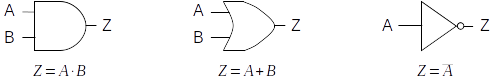{fig-align="center"}

As in ordinary algebra, Boolean algebra uses parentheses to indicate
which operands go with which operators. The Boolean expression $A+(B⋅C)$
represents a completely different circuit from $(A+B)⋅C$ .  In the
first, B and C are fed into an and gate, with the result being sent
(along with A) into an or gate. In the second, A and B are fed into an
or gate, with the result being combined with C via an and gate.

As you may be beginning to suspect, there is a direct correspondence
between Boolean expressions and logic circuits. Every logic circuit that
can ever be constructed will have a corresponding Boolean expression,
and every valid Boolean expression that can ever be written maps to an
equivalent logic circuit. The process of converting between the two
representations is quite mechanical: simply use the substitutions above,
being sure to parenthesize Boolean expressions in a manner that
preserves which operators go with which operands.

::: {.callout-important title="Activity" collapse=true}
Try to write the Boolean expression corresponding to the following
circuit:

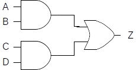{fig-align="center"}
:::

Boolean algebra provides computer scientists and engineers a powerful
tool for concisely representing circuits and reasoning about their
behavior. While the details are beyond the scope of this lesson, Boolean
algebra allows us to do things like prove that two different circuits
compute the same function; or find simpler (and thus less expensive)
ways of implementing the functionality of a circuit.

## Other Gates

Any device, whose operation can be defined in terms of a truth table or
Boolean expression, can be implemented using only the fundamental logic
gates: *and*, *or*, and *not*. However, a number of additional gates are
usually defined, as they prove useful for practical purposes. For
example, it is frequently the case that a not will immediately follow an
*and* gate, like so:

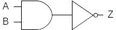{fig-align="center"}

Since this is such a common occurrence, the circuit has been given a
name (*nand*) and a gate symbol (the *and* symbol combined with the
bubble from the *not* symbol).  Similarly, *not* often follows *or*, so
there is a *nor* gate whose symbol is the bubble from the *not* attached
to the *or* symbol. The following figure illustrates both the *nand* and
*nor* gates. Their behavior, in terms of Boolean expressions, is
provided as well. It is important to remember that these gates are
simply a convenience (a kind of shorthand), in that they allow a circuit
to be constructed from fewer underlying components.

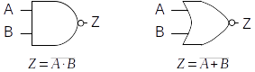{fig-align="center"}

As another example, the basic *and* and *or* gates support only two inputs;
however, a circuit designer will frequently need to *and* or *or* more than
two inputs. For this reason multi-input and and or gates exist.

The following figure presents the three and four input *and* and *or*
gates along with their Boolean expressions:

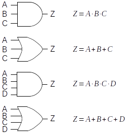{fig-align="center"}

While these gates are often quite convenient, remember that it is always
possible to construct equivalent circuits from the underlying two-input
gates. For example, the following circuit represents one possible
implementation of a four-input *and* gate:

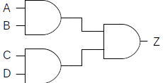{fig-align="center"}

Its Boolean expression is $Z =(A⋅B)⋅(C⋅D)$ . Note, however, that it
could be designed differently (with a different Boolean expression), yet
still represent a four-input and gate. For example, $Z =((A⋅B)⋅C)⋅D$
would also work. The other multi-input gates can be constructed in a
similar manner.

In addition to multi-input *and* and *or* gates, multi-input *nand* and
*nor* gates can be constructed. The symbols for these gates are
identical to the symbols for the multi-input *and* and *or* gates, with
the exception of a *not* bubble attached to the output of each gate
symbol. Their Boolean expressions are also identical as well, except
that a *not* bar appears above the right-hand side of the expression.

## Combinational Circuits

::: {.callout-tip title="Definition"}
**Combinational circuits** are digital circuits that do not involve any kind
of feedback. In other words, the output of a combinational circuit
cannot be fed back into that circuit as input.
:::

In this lesson, we will focus on the simplest combinational circuits.
Let's start with a relatively simple circuit, the *exclusive or*.

An exclusive or, or *xor*, has two inputs and a single output. Its
behavior is defined by the following truth table, where the inputs are
labeled *A* and *B* and the output is labeled *Z*:

|A|B|Z|
|-|-|-|
|0|0|0|
|0|1|1|
|1|0|1|
|1|1|0|

: Truth table for XOR gate {.striped .hover}

Like the standard two-input or, the *xor* produces a 1 (true) when
either of its inputs are 1, and a 0 (false) when both of its inputs are
0. The difference between *or* and *xor* appears in the case when both
inputs are 1. The standard *or* produces a 1 in this case. The *xor*
generates a 0. In other words, the “exclusive or” outputs a 1 when
either, *but not both*, of its inputs are 1.

English does not contain a unique word for expressing the idea of *xor*
– the word “or” does double duty for both its “inclusive” and
“exclusive” forms. However, one can usually tell from the context of a
sentence which form is intended. For example, if you tell a child “you
can have candy or popcorn,” the intended meaning is exclusive or –
either candy or popcorn, but not both. On the other hand, if a friend
says “I’d be happy winning either the Porsche or the Mercedes,” the
intended meaning is inclusive or – you would certainly not expect your
friend to become unhappy if he won both cars.

Now that we understand the behavior of *xor* in terms of its inputs and
outputs, we can turn our attention to the problem of designing a circuit
with its behavior. But how are we to begin?

One approach that often gets you moving in the right direction is to
examine the truth table to determine the various circumstances under
which the circuit must produce a 1. In the case of xor, there are two
such cases: one in which input A is 0 and input B is 1, and another in
which input A is 1 and input B is 0.  Once these cases have been
identified, we proceed by designing *sub-circuits* that will produce 1
in each of the required cases. The final step is to combine the
sub-circuits together using an *or* gate. This is necessary because the
main circuit would be true under any of the cases in which the
sub-circuits generate a 1.

The following sub-circuit will generate a 1 when input A is 0 and input
B is 1. Its Boolean expression is $Z=\bar A⋅B$:

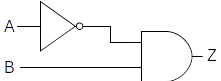{fig-align="center"}

It works by negating A and feeding that result (together with B) into an
*and* gate. Since both of the inputs to an *and* must be 1 for it to
produce a 1, the original value of A must be 0, while the value of B
must be 1. Under all other circumstances this sub-circuit produces 0.
Thus, this circuit successfully captures the meaning of line two of the
*xor* truth table.

A sub-circuit to implement line three of the xor truth table can be
constructed similarly. Its Boolean expression is $Z =A⋅\bar B$ :

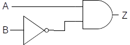{fig-align="center"}

This circuit generates a 1 whenever input A is 1 and B is 0. Under all
other circumstances, it produces a 0. The following figure illustrates a
complete *xor* circuit, which contains the two sub-circuits joined
together by an *or* gate. This is reasonable since the *xor* can be true
either by way of the first sub-circuit or the second. Note that due to
the manner in which the two sub-circuits were constructed, it is
impossible for both of them to be true at the same time.

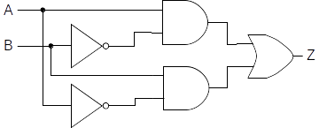{fig-align="center"}

The Boolean expression for this circuit is $Z =(A⋅\bar B)+(\bar A⋅B)$ .

