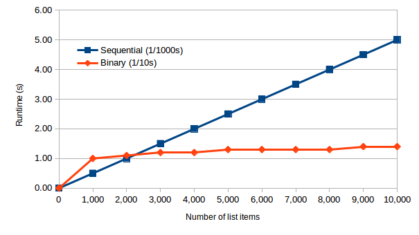

Some of you may have realized that the runtime of a sequential search is dependent on the size of the list that is being searched. Sequentially searching through a list of 1,000 items (as in the activity above) will typically take ten times as long as searching through a list of 100 items (i.e., 100 is one-tenth of 1,000). In the best case, the item will be found at the beginning of the list (i.e., it requires searching through only one item). In the worst case, the item will be found at the end of the list or not found at all (i.e., it requires searching through the entire list). On average, the algorithm would have to search through about half of the list.

Consider the scenario of searching for a name that corresponds to a specific phone number in a phone book. This is the reverse of what is normally done (i.e., searching for a phone number that corresponds to a given name). How could this be done? The only way is to perform a sequential search, starting at the beginning of the phone book. This could take a long time, and it would be utterly depressing if the phone number was not found in the phone book. While the sequential search is effective, there are scenarios (like this one) where a more efficient way of searching is preferable.

Consider the normal approach to searching a phone book for a phone number that corresponds to a given name. A sequential search would require starting the search at the beginning of the phone book and continue until either the name is found or until the entire phone book is exhausted. However, a phone book has a specific quality that can be taken advantage of which makes searching significantly easier and faster: it is ordered in a meaningful way. The names in a phone book are arranged in alphabetical order. This makes searching easier in that only a small subset of the names have to actually be searched through. When searching through a phone book, the usual process is to thumb through it until the first letter of the given name is reached. From there, a sequential search (of sorts) is performed to search for the given name.

A method that may be better suited for computing is to open the phone book in the middle. If the given name starts with a letter in the alphabet that comes before the one that is there, then the right half of the phone book can be ignored. With a single comparison, half of the phone book has been eliminated. This strategy can be continued by shifting to the part of the phone book that represents the halfway point in the first half of the phone book. Another comparison is performed to determine if the given name appears before or after this point. This continues until the given name is found. With each check, half of the remaining portion is eliminated.

This strategy can be used to guess a number from one to 1,000 much more efficiently than by doing a sequential search. So how is the halfway point (or middle value) calculated? Given a list of *n* items, we calculate the middle as follows:

$$\left\lfloor \frac{n}{2} \right\rfloor + 1$$

Note that the brackets represent the **floor function** which means to round down to the largest previous integer. For example, the floor of 3.14 is 3, and the floor of 27.9 is 27. For an odd number of values, this selects the middle value (i.e., there are an equal number of values on either side of the selected value). For an even number of values, this selects the value to the right of the "middle" (i.e., there is one more value to the left of the selected value than there are to the right). The following simpler formula may, at first, seem equivalent:

$$\left\lceil \frac{n}{2} \right\rceil$$

Indeed, it is for odd values of *n*; e.g., for *n* = 5:

$$\left\lfloor \frac{5}{2} \right\rfloor + 1 = \lfloor 2.5 \rfloor + 1 = 2 + 1 = 3$$

$$\left\lceil \frac{5}{2} \right\rceil = \lceil 2.5 \rceil = 3$$

However, it is not equivalent for even values of *n*; e.g., for *n* = 6:

$$\left\lfloor \frac{6}{2} \right\rfloor + 1 = \lfloor 3 \rfloor + 1 = 3 + 1 = 4$$

$$\left\lceil \frac{6}{2} \right\rceil = \lceil 3 \rceil = 3$$

Some of you may have naturally implemented this algorithm in the activity above. Let's formally define it now in pseudocode:

```
1:  repeat
2:      n ← number of items in the current portion of the list
3:      mid ← floor(n / 2) + 1
4:      guess mid
5:      if response is HIGHER
6:      then
7:          discard the left half of the list
8:      else if response is LOWER
9:      then
10:         discard the right half of the list
11:     end
12: until guess is correct
```

This algorithm is known as a **binary search**. Note that it supposes that every number from 1 to *n* is in the list as in the activity above.

> **Definition:** Binary search is the process of locating a value in an ordered list of values by repeatedly comparing the value in the middle of the relevant portion of the list to the desired value and discarding the appropriate half of the list. Searching terminates when either the desired value is located or the list can no longer be divided in half.

Here is an example of the binary search for the value **70** applied to a list containing the following values: 10, 20, 30, 40, 50, 60, 70, 80, 90, 100:

| Search List | Comparison | Action |
|---|---|---|
| 10, 20, 30, 40, 50, 60, 70, 80, 90, 100 | 60 < 70 | Target not found; discard left half |
| 70, 80, 90, 100 | 90 > 70 | Target not found; discard right half |
| 70, 80 | 80 > 70 | Target not found; discard right half |
| 70 | 70 = 70 | Target found; stop |

The list is initially split in the middle at 60 (since there are 10 values, and floor(10/2) + 1 is 6 – the sixth value in the list). Since 60 is less than 70, we can safely discard the left half of the list (including the split value 60) and continue with the right half of the list: 70, 80, 90, 100. This smaller sub-list is split in the middle at 90. Since 90 is greater than 70, we can safely discard the right half of the sub-list (including the split value 90) and continue with the left half of the sub-list: 70, 80. This smaller sub-list is split in the middle at 80. Since 80 is greater than 70, we can safely discard the right half of the sub-list (including the split value 80) and continue with the left half of the sub-list: 70. This sub-list has a single value (70) which, when compared to 70, is found to be the target value. In four comparisons, the target value was found in the list.

What would happen if we tried to search the list for a value that the list doesn't contain? Here is an example of the binary search for the value **45** applied to a list containing the same values as before:

| Search List | Comparison | Action |
|---|---|---|
| 10, 20, 30, 40, 50, 60, 70, 80, 90, 100 | 60 > 45 | Target not found; discard right half |
| 10, 20, 30, 40, 50 | 30 < 45 | Target not found; discard left half |
| 40, 50 | 50 > 45 | Target not found; discard right half |
| 40 | 40 < 45 | Target not found; discard left half |
| empty list | none | Target not found; stop |

It should be evident that the binary search is significantly faster than a sequential search. It turns out that guessing a number from 1 to 10,000 using the binary search will take, at most, 14 guesses. Intuitively, this is because 10,000 can be divided in half roughly 14 times: 10,000 is reduced to 5,000, then to 2,500, then to 1,250, then to 625, then to 313, then to 157, then to 79, then to 40, then to 20, then to 10, then to 5, then to 3, then to 2, and finally to 1 (14 total splits). We can actually calculate this precisely by solving the following equation:

$$2^n = 10000$$

Exponentiation is the reverse of logarithms. That is, $2^n = 10000$ expresses the same relationship as $\log_2 10000 = n$. We can visualize how the binary search works to find a value in a list of 10,000 values by illustrating each guess (the middle value):

| Comparison | List size | Items on left | Middle value | Items on right | Remaining items |
|---|---|---|---|---|---|
| 1 | 10,000 | 5,000 | 5,001 | 4,999 | 5,000 |
| 2 | 5,000 | 2,500 | 2,501 | 2,499 | 2,500 |
| 3 | 2,500 | 1,250 | 1,251 | 1,249 | 1,250 |
| 4 | 1,250 | 625 | 626 | 624 | 625 |
| 5 | 625 | 312 | 313 | 312 | 312 |
| 6 | 312 | 156 | 157 | 155 | 156 |
| 7 | 156 | 78 | 79 | 77 | 78 |
| 8 | 78 | 39 | 40 | 38 | 39 |
| 9 | 39 | 19 | 20 | 19 | 19 |
| 10 | 19 | 9 | 10 | 9 | 9 |
| 11 | 9 | 4 | 5 | 4 | 4 |
| 12 | 4 | 2 | 3 | 1 | 2 |
| 13 | 2 | 1 | 2 | 0 | 1 |
| 14 | 1 | 0 | 1 | 0 | 0 |

Consider a simpler problem of guessing a number from 1 to 1,000. How many guesses would that take? We know that $2^{10} = 1024$ and that $2^9 = 512$; therefore, 1,000 can be divided by two between 9 and 10 times. However, it's evident that it's closer to 10 than it is to 9. In fact, it is actually 9.97 times. Recall that, on average, it would take 500 guesses if the sequential search were used instead. The binary search is therefore 50 times faster than the sequential search for a list of 1,000 values (500 guesses / 10 guesses = 50). What about the comparison for a list of 1 billion values? The sequential search would take, on average, 500 million comparisons. The binary search would take, at worst, 30 comparisons. That's almost 17 million times faster!

::: {.callout-note}
## Did you know?

To solve for *n* in $2^n = 1000$, we can use the formula that expresses the inverse of raising two to a power: $\log_2 1000 = n$. Logarithms represent the power to which some number, called the base (in this case, 2), must be raised to produce a given number (in this case, 1,000). Most calculators do not have a $\log_2$ function; however, they typically do have a $\log_{10}$ function (note that most calculators denote this as log and omit the base). We can convert easily by using the following conversion (where *b* is the given base and *d* is the desired base):

$$\log_b x = \frac{\log_d x}{\log_d b}$$

In the example above where the given base is 2, the target base is 10, and *x* is 1000, we can convert as follows:

$$\log_2 1000 = \frac{\log_{10} 1000}{\log_{10} 2} = 9.97$$

For giggles, how many tries would it take to guess a number from one to 1 billion?

$$\log_2 \text{1 billion} = \frac{\log_{10} \text{1 billion}}{\log_{10} 2} = 29.9$$
:::

Searching for a target value in a list containing *n* items requires, at maximum, the following number of comparisons:

$$\lceil \log_2 (n+1) \rceil$$

Note that the brackets represent the **ceiling function** which means to round up to the smallest following integer. For example, the ceiling of 3.14 is 4, and the ceiling of 27.1 is 28. You may be confused why we're taking the logarithm of *n*+1. Consider the simplest case of a list containing a single item (i.e., *n* = 1). $\lceil \log_2 (1+1) \rceil = 1$. Clearly, a list containing a single value requires at most a single comparison!

The following table shows the number of comparisons required to search through a list of values ranging from 0 to 10,000 items using both the sequential search (average number of comparisons) and binary search (maximum number of comparisons). It also includes a performance measure that compares how much better the binary search is when compared to the sequential search. It is amazing to see the huge difference in the performance of the two algorithms:

| Number of items | Sequential search | Binary search | Performance |
|---|---|---|---|
| 0 | 0 | 0 | 0 |
| 1,000 | 500 | 10 | 50 |
| 2,000 | 1,000 | 11 | 91 |
| 3,000 | 1,500 | 12 | 125 |
| 4,000 | 2,000 | 12 | 167 |
| 5,000 | 2,500 | 13 | 192 |
| 6,000 | 3,000 | 13 | 231 |
| 7,000 | 3,500 | 13 | 269 |
| 8,000 | 4,000 | 13 | 308 |
| 9,000 | 4,500 | 14 | 321 |
| 10,000 | 5,000 | 14 | 357 |

For a list of 1,000 items, the binary search is roughly 50 times faster than the sequential search, and for a list of 10,000 items, the binary search is roughly 357 times faster. This, however, does not take into consideration that the binary search takes extra calculations (i.e., calculating the middle of the current portion of the list, discarding half of the list, etc). However, suppose that each binary search comparison takes 1/10 of a second and each sequential search comparison takes 1/1000 of a second. We can still observe that the binary search ridiculously outperforms the sequential search as illustrated in Figure 1. Also note that the time it takes to initially order the list of numbers is not considered. Since the binary search requires the list to be ordered, it is worthwhile to investigate various ordering methods and their performance.


