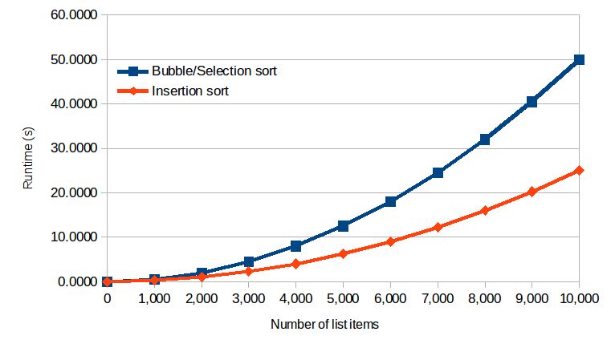

When comparing the insertion sort to other sorts, generally the average case formula is used since this represents the expected performance of the algorithm. Occasionally, knowledge of the worst case behavior of the algorithm is also important. Understanding this behavior is useful when attempting to determine or limit the maximum amount of time a computing system will take to reach an answer, even in the worst case. Such behavior is important in real time applications such as airplane flight control systems.

The bubble sort and the selection sort always require exactly $\frac{1}{2}(n^2-n)$ comparisons to sort *n* items. In the worst case, the insertion sort also requires $\frac{1}{2}(n^2-n)$ comparisons. In the average (expected) case, however, the insertion sort requires $\frac{1}{4}(n^2-n)$ comparisons, and therefore requires about one half of the comparisons needed by the bubble and selection sorts. Figure 2 shows the runtime comparison of the three sorts, considering a machine capable of performing 1 million comparisons per second. The smaller number of comparisons needed by the insertion sort means that it is generally a faster algorithm than the bubble or selection sorts, assuming a comparison takes the same amount of time in both algorithms (a reasonable assumption). The insertion sort will be expected to process a 10,000 item list in about 25 seconds (precisely 24.9975 seconds). The bubble and selection sorts are both expected to take about 50 seconds on the same problem (precisely 49.995 seconds) – or about twice as long.

